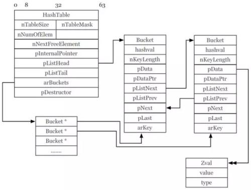

# 数据结构

**一.变量**

```
PHP变量是存放在一个_zval_struct的结构体中(Zend/zend.h)

struct _zval_struct {
	zvalue_value value;  //变量的值
	zend_uchar type; //变量类型
	zend_uchar is_ref__gc; //是否是引用(引用传值)
	zend_uint refcount__gc; //指向的数量
};

变量值类型共用体
typedef union _zvalue_value {
	long lval;		//整型
	double dval;		//浮点型
	struct {           //字符串型
		char *val;
		int len;
	} str;
	HashTable *ht;  //哈希类型
	zend_object_value obj; //对象类型
} zvalue_value;

变量的类型
#define IS_NULL 0
#define IS_LONG 1
#define IS_DOUBLE 2
#define IS_STRING 3
#define IS_ARRAY 4
#define IS_OBJECT 5
#define IS_BOOL 6
#define IS_RESOURCE 7
```

<br>

**二.传值类型**

```
传值赋值

$a=3;
$b=$a;
$b=5;

(1).当$a初始化时，开辟一块空间
    {
        value:3,
        type:IS_LONG,
        is__ref__gc:0,
        refcount__gc:1
    }
(2).当$b初始化时，$b指向与$a相同的内存块
    {
        value:3,
        type:IS_LONG,
        is__ref__gc:0,
        refcount__gc:2
    }
(3).当$b($a)改变时，发生分裂，生成两块内存块,cow(copy on write)
```

```
引用传值

$a=3;
$b=&$a;
$b=5;

(1).当$a初始化时，开辟一块空间
    {
        value:3,
        type:IS_LONG,
        is__ref__gc:0,
        refcount__gc:1
    }
(2).当$b初始化时，$b指向与$a相同的内存块
    {
        value:3,
        type:IS_LONG,
        is__ref__gc:1,
        refcount__gc:2
    }
(3).当$b($a)改变时，不发生分裂，直接修改同一块内存块的结构体
```

<br>

**三.常量**

```
PHP常量是存放在一个_zend_constant的结构体中(Zend/zend_constants.h)
typedef struct _zend_constant {
    	char *name;//常量名
	uint name_len;//常量名长度
	zval value; //常量值
	int flags; //是否大小写敏感
	int module_number;//模块号(表示是否用户定义还是系统定义)
} zend_constant;
```

<br>

**四.hashTable**



```
PHP哈希类型存放在一个_hashtable的结构体中(Zend/zend_hash.h)
typedef struct _hashtable {
    uint nTableSize;            /* hash表的大小 */
    uint nTableMask;            /* 掩码，用于根据hash值计算存储位置，永远等于nTableSize-1 */
    uint nNumOfElements;        /* hash表中元素的个数 */
    ulong nNextFreeElement;     /* 下一个空闲可用位置的数字索引 */
    Bucket **arBuckets;         /* 指向bucket容器 */
    Bucket *pInternalPointer;   /* 内部指针，用于HashTable遍历 */
    Bucket *pListHead;          /* 双向链表的头指针 */
    Bucket *pListTail;          /* 双向链表的尾指针 */
} HashTable;

bucket容器
typedef struct bucket {
    ulong h;            /* hash值，下标为数字索引时，h就是索引值 */
    uint nKeyLength;    /* key字符串的长度，当nKeyLength为0时表示是数字索引 */
    void *pData;        /* 实际存放的数据 */
    void *pDataPtr;     /* 数据指针 */
    struct bucket *pListNext;      /* 下一个元素, 用于线性遍历 */
    struct bucket *pListLast;      /* 上一个元素, 用于线性遍历 */
    struct bucket *pNext;          /* 处于同一个拉链中的下一个元素 */
    struct bucket *pLast;          /* 处于同一拉链中的上一个元素 */
    const char *arKey;             /* key字符串指针 */
} Bucket;
```

<br>

**五.数组实现**

```
(1).HashTable的pListhHead指向线性列表形式下的第一个元素, pListTail指向的是最后一个元素
(2).pInternalPointer指向当前的内部指针的位置, 在对数组进行顺序遍历的时候, 这个指针指明了当前的元素.
(3).当在线性(顺序)遍历的时候, 就会从pListHead开始,  根据移动pInternalPointer, 来实现对所有元素的线性遍历.
(4).所以对于foreach,  我们在foreach之前, 会首先有个FE_RESET来重置数组的内部指针, 也就是pInternalPointer， 然后通过每次FEWFETCH来递增pInternalPointer,从而实现顺序遍历.类似的, 当我们使用each/next系列函数来遍历的时候, 也是通过移动数组的内部指针而实现了顺序遍历.
```

<br>

**六.变量作用域**

```
PHP普通变量是存放在一个_zval_executor_globals的结构体中(Zend/zend_globals.h)
全局符号表:保存了在顶层作用域(就是不在任何函数，对象内)的变量。
活动符号表:函数(对象)内定义的变量

struct _zend_executor_globals {
    HashTable *active_symbol_table;/*活动符号表*/
    HashTable symbol_table;     /*全局符号表*/
};

PHP静态变量是存放在一个_zval_op_array的结构体中(Zend/zend_compile.h)
struct _zend_op_array {
	HashTable *static_variables;
};
```

```
$name = "global symbol";
function test(){
    $name= "active symbol"
    echo $name;
}
test();
echo $name;

在函数test外面的变量$name,它会被填入全局符号表中，与他对应的有一个zval指针，这个zval保存了一个字符串”global symbol”.
函数内的$name, 它会被填入属于函数test的活动符号表中，与他对应的zval中，保存着字符串"active symbol"
```

<br>

**七.对象类型**

```
PHP对象类型是存放在一个_zend_object_value的结构体中(Zend/zend_types.h)
typedef struct _zend_object_value {
	zend_object_handle handle;  //标识符(整形序号),表明了当前对象存储在全局对象列表的位置
	const zend_object_handlers *handlers; //指向当前对象所属类的handlers(标准操作集合)
} zend_object_value;

typedef unsigned int zend_object_handle;
```

```
class Test{
    public $name = 'test';
    public $age = 28;
}

$test = new Test();

(1).当$test初始化时，开辟一块空间
    {
        value:{handle:23851},
        type:IS_OBJECT,
        is__ref__gc:0,
        refcount__gc:1
    }
(2).handle所开辟的内存空间
    {
        name:'test',
        age:28
    }
```