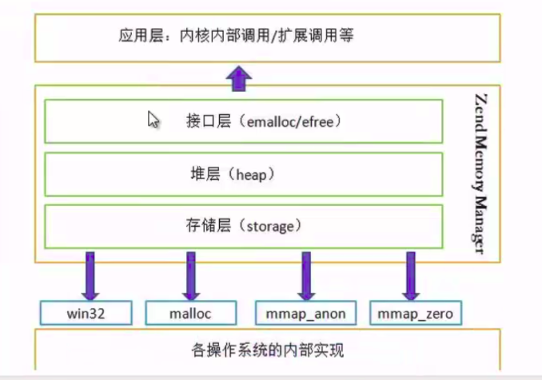

# 内存管理


**一.内存管理**



```
存储层:这一层是内存的申请，ZendMM向系统进行的内存申请，并不是有需要时向系统即时申请， 而是由ZendMM的最底层（heap层）
先向系统申请一大块的内存，通过对上面三种列表的填充， 建立一个类似于内存池的管理机制。 在程序运行需要使用内存的时候，
ZendMM会在内存池中分配相应的内存供使用。 这样做的好处是避免了PHP向系统频繁的内存申请操作.

堆层:这一层是初始化内存，PHP内存管理主要维护三个列表:(1)小块内存列表 free_buckets;(2)大块内存列表 large_free_buckets
;(3)剩余内存列表 rest_buckets

接口层:就是一些宏定义，主要是我们自己编写的一些应用程序
```

<br>

**二.内存的销毁**

>ZendMM在内存销毁的处理上采用与内存申请相同的策略，当程序unset一个变量或者是其他的释放行为时， ZendMM并不会直接立刻将内存交回给系统，而是只在自身维护的内存池中将其重新标识为可用， 按照内存的大小整理到上面所说的三种列表（small,large,free）之中，以备下次内存申请时使用。程序使用的所有内存，将在进程结束时统一交还给系统。