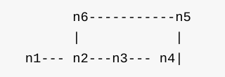

# 环形链表


给定一个链表，返回链表开始入环的第一个节点。 如果链表无环，则返回null。不允许修改给定的链表。

#### 分析



a.判断一个链表是否存在环,我们使用两个指针,一个每次走两步,一个每次走一步,如果一段时间之后这两个指针能重合,那么铁定存在环了。

b.fast每次比slow多走一步,所以重合的时候,fast移动的距离是slot的两倍,我们假设n1到n2距离为a,n2到n6距离为b,n6到n2距离为c,fast走动距离为 a + b + c + b ,而slow为 a + b ,有方程 a + b + c + b = 2 x (a +b) ,可以知道 a = c ,所以我们只需要在重合之后,一个指针从n1,而另一个指针从n6,都每次走一步,那么就可以在n2重合了。

```cpp
struct ListNode {
	int val;
	ListNode *next;
	ListNode(int x) : val(x), next(NULL) {}
};

ListNode *detectCycle(ListNode *head) {
	if (head == NULL || head->next == NULL) return NULL;
	//定义快指针
	ListNode* fast = head;
	//定义慢指针
	ListNode* slow = head;
	while (fast->next != NULL && fast->next->next != NULL) {
		//快指针2步/次，慢指针1步/次
		fast = fast->next->next;
		slow = slow->next;
		//直到快指针与慢指针重合，则说明链表存在环
		if (fast == slow) {
			//慢指针回到head
			slow = head;
			//快指针1步/次，慢指针1步/次，直到重合则为环入口
			while (slow != fast) {
				fast = fast->next;
				slow = slow->next;
			}
			return slow;
		}
	}
	return NULL;
}
```
