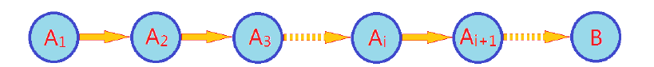
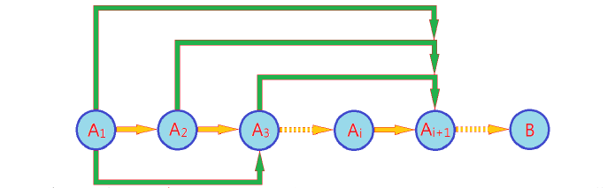

# 最长递增子序列


给定长度为N的数组A，计算A的最长的单调递增的子序列长度（不一定连续）。

```
输入:
1 4 6 2 8 9 7
```

```
输出:
5
```

### 分析

a.LIS[i]表示以ai结尾的最长递增子序列则有:

A[i]|1|4|6|2|8|9|7
--|--|--|--|--|--|--|--
LIS[i]|1|2|3|2|4|5|4

b.若已知LIS[i]如何求LIS[i]：将ai+1分别缀到a0...ai上，如果ai>=aj,则可以追加(LIS[i]=LIS[j]+1)，否则不可以追加，综上所述状态转移方程:

```
LIS[i]={max(LIS[j])+1,0<=j<i且aj<=ai}
```
c.当求出LIS数组后，遍历数组找出最大元素即为所求。

### 源码

```cpp
int LIS(vector<int> &str) {
    //初始化LIS数组
    vector<int> aux(str.size(), 1);
    //记录最长递增子序列
    int mx = 1;
    for (int i = 1; i < str.size(); i++) {
        for (int j = 0; j < i; j++) {
            if (str[j] <= str[i])
                aux[i] = max(aux[i], aux[j] + 1);
        }
        mx = max(mx, aux[i]);
    }
    return mx;
}
```

### 动态规划理论

>基本归纳法:对于Ai+1，只需要考察A1...Ai其中最优一个状态Aj即可以完成整个推理过程，它的特点是只要状态Aj确定，则计算Ai+1时不需要考察更前序的状态A1....Ai。我们将这一模型称为马尔科夫模型(贪心法)。



>高阶归纳法:对于Ai+1，只需要考察前i个状态集{A0...Ai}才可以完成整个推理过程，往往称之为高阶马尔科夫模型(动态规划)。


