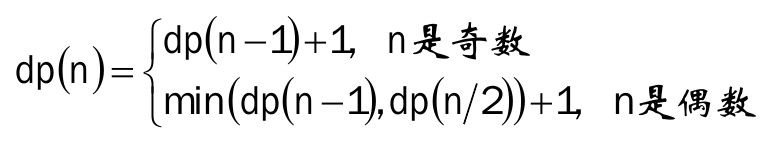
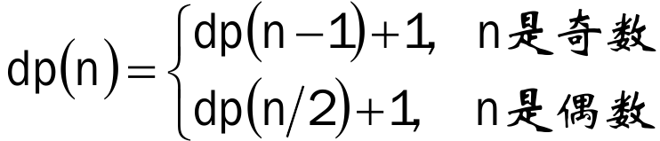

# 操作最小次数


变量x从1开始变化，规则是：要么变成x+1，要么变成2*x，问:若想将x变成整数2015，最少需要多少次变化。

#### 分析

设dp(n)表示从1到n的最小操作步数，若n为奇数，则n的前一步只能是n-1，若n为偶数，则n的前一步是n-1和n/2的操作步数的最小者。



#### 源码

```cpp
//设dp[i]表示从1到i的最小操作步数，pre[i]表示i的前驱，n表示终点
int calcCount(vector<int> &dp, vector<int> &pre, int n) {
    if (n == 1) return 0; //递归结束条件
    if (n % 2 == 1) {//奇数
        //当前一个数的dp未知时（即dp[n-1]=0）
        if (dp[n - 1] == 0)
            dp[n - 1] = calcCount(dp, pre, n - 1);
        //更新当前n的dp[n]与pre[n]
        pre[n] = n - 1;
        dp[n] = dp[n - 1] + 1;
    } else {//偶数
        //当dp[n/2]未知时（即dp[n/2]=0）
        if (dp[n / 2] == 0)
            dp[n / 2] = calcCount(dp, pre, n / 2);
        //当dp[n-1]未知时（即dp[n-1]=0）
        if (dp[n - 1] == 0)
            dp[n - 1] = calcCount(dp, pre, n - 1);
        //比较dp[n-1]与dp[n/2]，当前dp[n]取两个中的最小值
        if (dp[n / 2] < dp[n - 1]) {
            pre[n] = n / 2;
            dp[n] = dp[n / 2] + 1;
        } else {
            pre[n] = n - 1;
            dp[n] = dp[n - 1] + 1;
        }
    }
    //返回当前n的最小操作步数
    return dp[n];
}
```

#### 贪心法

```
输出路径序列:
1,2,3,6,7,14,15,30,31,62,124,125,
251,502,503,1006,1007,2014,2015
```

a.从结果可以看出:如果当前数是奇数，则减一；如果当前数是偶数，则折半。所以新的状态方程:



#### 源码

```cpp
//pre[i]表示i的前驱，n表示终点
int calcCount(vector<int> &pre, int n) {
    while (n > 1) {
        if (n % 2 == 0)//偶数
            n /= 2;
        else//奇数
            n--;
        //添加前驱
        pre.push_back(n);
    }
    reverse(pre.begin(),pre.end());
    return static_cast<int>(pre.size());
}
```
