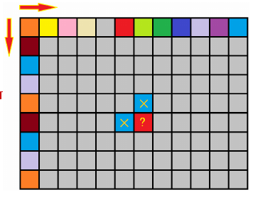
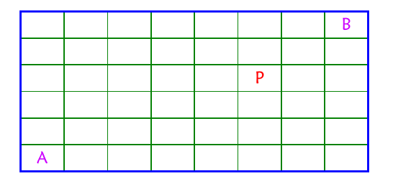
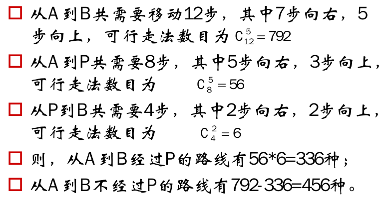

# 走棋盘问题


给定m*n的矩阵，每个位置是一个非负整数，在左上角放一个机器人，它每次只能往右和下走，直到右下角，求所有路径中，总和最小的那条路径。



#### 分析

a.当在第0列（行）上的最短路径为dp(i,0)=chess[0][0]+....+chess[i][0]或dp(0,j)=chess[0][0]+....+chess[0][j]

b.当在i列j行上时，dp[i][j]=min(dp[i-1][j]+chess[i][j],dp[i][j-1]+chess[i][j])

```
dp(i,0)=chess[0][0]+....+chess[i][0]
dp(0,j)=chess[0][0]+....+chess[0][j]
dp[i][j]=min(dp[i-1][j],dp[i][j-1])+chess[i][j]
```

c.以每一行为单位计算每一列的值，下一行的值由上一行决定，可以简化为滚动数组(dp(j)表示dp[i-1][j],dp(j-1)表示dp[i][j-1])

```
dp(j)=chess[0][0]+....+chess[0][j]
dp(j)=min(dp(j),dp(j-1))+chess[i][j]
```

#### 源码

```cpp
int MinPath(vector<vector<int>> &chess) {
    //初始化以每行为单位的滚动数组
    vector<int> path(chess[0].size());
    path[0] = chess[0][0];
    for (int i = 1; i < path.size(); i++)
        path[i] = path[i - 1] + chess[0][i];
    //依次计算每一行
    for (int i = 1; i < chess.size(); i++) {
        //依次处理每一列
        path[0] += chess[i][0];
        for (int j = 1; j < path.size(); j++) {
            //谁小取谁
            if (path[j - 1] < path[j])
                path[j] = path[j - 1] + chess[i][j];
            else
                path[j] = path[j] + chess[i][j];
        }
    }
    return path.back();
}
```


# 走棋盘问题（带陷阱）I


给定m*n的矩阵，在左上角放一个机器人，它每次只能往右和下走，直到右下角，其中有些格子是禁止机器人通过的(可以通过为true，不能通过为false)，求所有路径和。

#### 分析

dp[i][j]表示从起点到(i,j)的路径条数，如果(i,j)被占用，则dp[i][j]=0，如果(i,j)不被占用，则dp[i][j]=dp[i-1][j]+dp[i][j-1]。

```
dp(j)=1
dp(j)=dp(j)+dp(j-1)
```

#### 源码

```cpp
int PathNumber(vector<vector<bool>> &chess) {
    //初始化以每行为单位的滚动数组
    vector<int> path(chess[0].size(), 0);
    path[0] = chess[0][0] ? 1 : 0;
    for (int i = 1; i < path.size(); i++)
        if (chess[0][i] && (path[i - 1] == 1))
            path[i] = 1;
    //依次计算每一行
    for (int i = 1; i < chess.size(); i++) {
        //依次处理每一列
        if (!chess[i][0]) path[0] = 0;
        for (int j = 1; j < path.size(); j++) {
            if (!chess[i][j]) //当前被阻塞
                path[j] = 0;
            else            //当前可以通过
                path[j] = path[j] + path[j - 1];
        }
    }
    return path.back();
}
```


# 走棋盘问题（带陷阱）II


在8*6的矩阵中，每次只能向上或向右移动一格，并且不能经过P，试计算从A到B一共有多少种走法。



#### 分析


