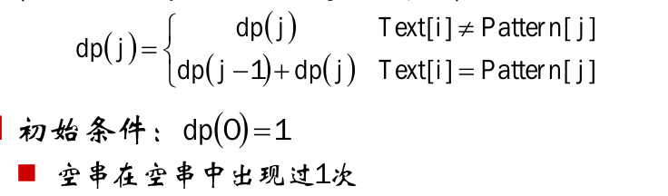

# 子序列数目


给定文本串Text和模式串Pattern，计算文本串Text的子序列中包含模式串Pattern的个数。如"ab"在"abacab"出现过4次。

#### 分析

记Pattern[0...j]在Text[0...i]中出现次数为dp[i][j]，若Pattern[j]!=Text[i]，则dp[i][j]=dp[i-1][j]；若Pattern[j]==Text[i]，则dp[i][j]=dp[i-1][j-1]或者dp[i][j]=dp[i-1,j]:


dp[i][j]的更新可以只需要前一行元素，所以可以使用滚动数组:



#### 源码

```cpp
int DistinctSubsequence(string &text, string &pattern) {
    if (text.size() < pattern.size())
        return 0;
    //初始化滚动数组
    vector<int> dp(pattern.size() + 1, 0);
    dp[0] = 1;
    //求出text从0到text.size()之间的字符串的dp数组
    for (int i = 0; i < text.size(); i++) {
        //从后向前遍历
        for (int j = pattern.size() - 2; j >= 0; j--) {
            if (text[i] == pattern[j])
                dp[j + 1] = dp[j + 1] + dp[j];
        }
    }
    return dp.back();
}
```
