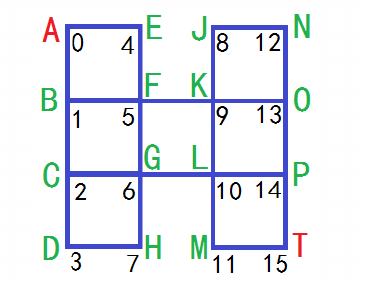

# 最短路径条数


给定如图所示的无向连通图，假定图中所有边的权值都为1，显然从源点A到终点T的最短路径有多少条，求不同的最短路劲的数目。



#### 分析

a.利用BFS遍历所有结点，当结点没有访问过或者被其它结点访问过但不是最短路径则将此节点入队。

#### 源码

```cpp
int calculate(int graph[16][16]){
	//定义到达当前结点的步数
	int step[16]={0};
	//定义到达当前结点的条数
	int path[16]={0};
	//每次出发结点列队
	queue<int> q;
	q.push(0);
	while(!q.empty()){
		int current = q.front();
		q.pop();
		for(int i=1;i<16;i++){
			if(graph[current][i]==1){
				if(step[i]==0||step[i]>current+1){
					//下一结点step为零(没有访问过)或step>当前结点step+1(其它结点访问过但不是最短路径)
					step[i]=current+1;
					path[i]=path[current];
					q.push(i);
				}else if(step[i]==current+1){
					//下一个结点step=当前结点step+1(其它结点访问过且是最短路径)
					path[i]+=path[current];
				}
			}
		}
	}
	//返回T结点的最短路径条数
	return path[15];
}
```
