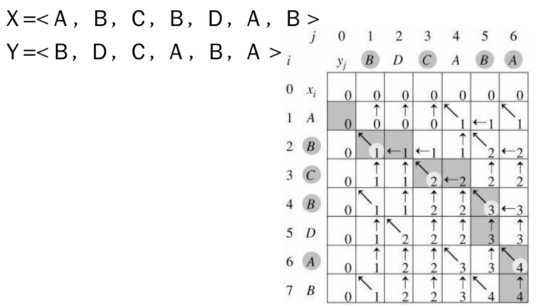

# 最长公共子序列(LongestCommonSubsequence,LCS)


一个序列S任意删除若干个字符得到新序列T,则T叫做S的子序列，两个序列X和Y的公共子序列中，长度最长的那个，定义为X和Y的最长公共子序列。注意最长公共子序列可能有多个。

```
输入:
acdfg
adfc
```

```
输出:
adf
```

### 分析

a.LCS可以描述两端文字之间的"相似度"，即它们的雷同程度，从而能够用来辨别抄袭。

b.LCS解法:

```
1).字符串X，长度为m，从1开始数；
2).字符串Y，长度为n，从1开始数；
3).Xi=<x1,...,xi>即X序列的前i个字符(1<=i<=m)(Xi不妨读作"字符串X的i前缀");
4).Yi=<y1,...,yi>即Y序列的前i个字符(1<=i<=m)(Yi不妨读作"字符串Y的i前缀");
5).LCS(X,Y)为字符串X和Y的最长公共子序列，即为Z=<z1,...,zk>(Z属于LCS(X,Y));
6).当xm=yn时，则LCS(Xm,Yn)=LCS(Xm-1,Yn-1)+xm;当xm!=yn时，则
LCS(Xm,Yn)=max{LCS(Xm-1,Yn),LCS(Xm,Yn-1)};
```

c.最长递增子序列(LongestIncreasingSubsequence,LIS):找出给定数组最长且单调递增的子序列。如给定数组A={5,6,7,1,2,8},排序后A'={1,2,5,6,7,8}，则只需要求A，A'的LCS即可。

d.最长公共子串(LongestCommonSubstring)：最长公共子串要求连续，所以当xm=yn时，则LCS(Xm,Yn)=LCS(Xm-1,Yn-1)+xm;当xm!=yn时，则LCS(Xm,Yn)=0;


### 源码

```cpp
string LCS(const char* str1,const char* str2){
	//返回最长公共子序列
	string ret;
	//str的长度
	int size1 = (int)strlen(str1);
	int size2 = (int)strlen(str2);
	//从1开始数，方便后面的代码编写
	const char* s1 = str1-1;
	const char* s2 = str2-1;
	//最长公共子序列的长度数组,arr[i][j]记录序列str1[i]和str2[j]最长公共子序列的长度
	vector<vector<int>> arr(size1+1,vector<int>(size2+1));
	int i,j;
	//构造长度数组，当i=0或j=0时，arr[i,j]=0
	for(i=0;i<=size1;i++)arr[i][0]=0;//第0列
	for(j=0;j<=size2;j++)arr[0][j]=0;//第0行
	for(i=1;i<=size1;i++){
		for(j=1;j<=size2;j++){
			if(s1[i]==s2[j])
				//i,j相等
				arr[i][j]=arr[i-1][j-1]+1;
			else
				//i,j不相等
				arr[i][j]=max(arr[i][j-1],arr[i-1][j]);
		}
	}
	i=size1;
	j=size2;
	//返回其中一个最长公共子序列
	while((i!=0)&&(j!=0)){
		if(s1[i]==s2[j]){
			ret.push_back(s1[i]);
			i--;
			j--;
		}else{
			if(arr[i][j-1]>arr[i-1][j])
				j--;
			else
				i--;
		}
	}
	reverse(ret.begin(),ret.end());
	return ret;
}
```


