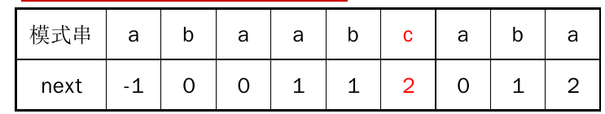

# KMP算法


给定文本串text和模式串pattern，从文本串text中找出模式串pattern第一次出现的位置。

#### 分析

a.记文本串长度为N，模式串长度为M

```
BF算法的时间复杂度O(M*N)，空间复杂度为O(1)
KMP算法的时间复杂度O(M+N)，空间复杂度为O(M)
```

```
当text[i+j]!=pattern[i],BF算法(i++,j=0)中模式串pattern相对于文本串text向右移动一位
当text[i+j]!=pattern[i],KMP算法(j=next[j])中模式串pattern相对于文本串text向右移动至少一位
```



b.next[j]求法，查找出pattern前j-1中最大的(前缀==后缀)字符个数

```
1).初始化next[0]=-1。
2).若next[j]=k，pattern[j]=pattern[k]，则next[j+1]=next[j]+1。
3).若next[j]=k，pattern[j]!=pattern[k]，则记h=next[k],如果pattern[h]==pattern[j]，则next[j+1]=h+1，
否则重复此过程。
```

#### 源码

```cpp
//BF算法
int BruteForce(string &s, string &p) {
    //初始化s位置i，p位置j
    int i = 0, j = 0;
    while ((i < s.size() - p.size()) && (j < p.size())) {
        if (s[i + j] == p[j]) {
            //若匹配，则模式串j向后移
            j++;
        } else {
            //若不匹配，则文本串i向后移，模式串j置0
            i++;
            j = 0;
        }
    }
    //当完全匹配时返回i，否则返回-1
    if (j >= p.size())
        return i;
    return -1;
}
```

```cpp
//KMP算法
void getNext(string &pattern, vector<int> &next) {
    //初始化next数组
    next[0] = -1;
    int k = -1, j = 0;
    while (j < pattern.size() - 1) {
        if (k == -1 || pattern[j] == pattern[k]) {
            //当k=-1表示未找到前缀==后缀
            //pattern[j]==pattern[k]表示找到前缀==后缀
            j++;
            k++;
            next[j] = k;
        } else {
            //表示pattern[j]!=pattern[k]
            k = next[k];
        }
    }
}

int KMP(string &s, string &p) {
    //初始化s位置i，p位置j，ret为返回值
    int i = 0, j = 0, ret = -1;
    //获取next数组
    vector<int> next(p.size(), 0);
    getNext(p, next);
    while (i < s.size()) {
        if (j == -1 || s[i] == p[j]) {
            //j==-1表示已经没有匹配项，则文本串i向后移，模式串j置0
            //若匹配，则文本串i向后移，模式串j向后移
            i++;
            j++;
        } else {
            //若不匹配，则模式串j置next[j]
            j = next[j];
        }
        if (j == p.size()) {
            ret = i - static_cast<int>(p.size());
            break;
        }
    }
    return ret;
}
```
