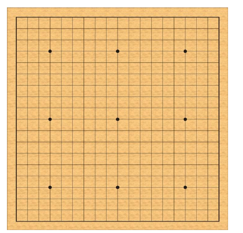
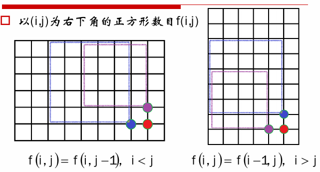
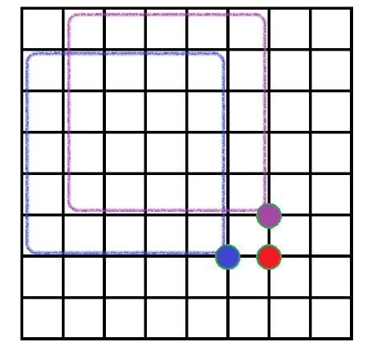
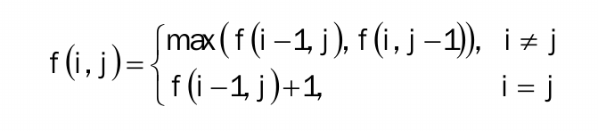
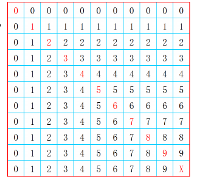

# 围棋中的正方形


围棋棋盘由横纵19*19条线组成，请问这些线共组成多少个正方形，假定只考虑横纵方向，忽略倾斜方向。



### 分析

1.当i!=j时，由下图可以得出以(i,j)为右下角的正方形数目f(i,j)=max(f(i-1,j),f(i,j-1))



2.当i==j时，由下图可以得出以(i,j)为右下角的正方形数目f(i,j)=f(i-1,j)+1



3.综上所述，可以得出状态方程



4.在根据状态矩阵可以得出f(i,j)=min(i,j)



### 源码

```cpp
//处于M*M的棋盘上
int getCount(size_t M) {
    //返回值
    int count = 0;
    //初始化M*M的矩阵
    vector<vector<int>> chess(M, vector<int>(M));
    for (int i = 0; i < M; i++) {
        chess[i][0] = 0;
        chess[0][i] = 0;
    }
    //递推关系
    for (int i = 1; i < M; i++) {
        for (int j = 1; j < M; j++) {
            if (i != j)
                chess[i][j] = max(chess[i - 1][j], chess[i][j - 1]);
            else
                chess[i][j] = chess[i - 1][j] + 1;
            count += chess[i][j];
        }
    }
    return count;
}
```

```cpp
//处于M*M的棋盘上
int getCount(size_t M) {
    //返回值
    int count = 0;
    //递推关系
    for (int i = 1; i < M; i++) {
        for (int j = 1; j < M; j++) {
            count += min(i, j);
        }
    }
    return count;
}
```