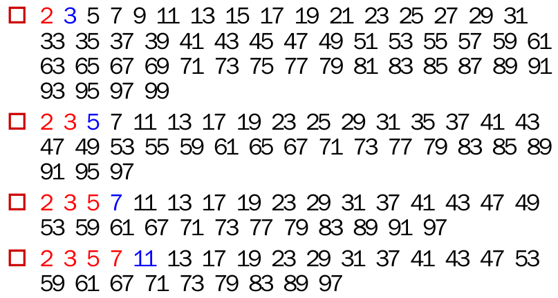

# Eratosthenes筛法求素数


给定正整数N，求小于等于N的全部素数。

### 分析

1.将2到N写成一排。

2.记排头元素(筛数)为x，则x是素数；除x以外，将x的倍数全部划去；

3.重复以上操作，直到x>sqrt(N)为止即可。



### 源码

```cpp
void Eratosthenes(vector<bool> &arr, int N) {
    //arr[0],arr[1]不是素数为false
    arr[0] = arr[1] = false;
    //初始化其它元素，默认全为true
    for (int i = 2; i <= N; i++)arr[i] = true;
    //p为筛数，j为p的第一个倍数
    int p = 2, j = p * p;
    while (j <= N) {
        //筛去p的所有倍数
        while (j <= N) {
            arr[j] = false;
            j += p;
        }
        //查找下一个筛数以及其第一个倍数
        p++;
        while (!arr[p])p++;
        j = p * p;
    }
}
```