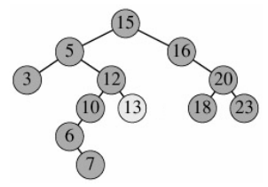
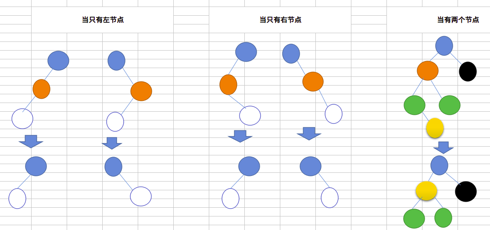

# 二叉搜索树




二叉搜索树满足以下条件的二叉树:

```
1).左子树上的所有结点值均小于根节点值
2).右子树上的所有结点值均不小于根节点值
3).左右子树也满足上述条件
```

#### 分析

a.删除树:



#### 源码

```cpp
struct BitNode {
	int data;
	BitNode *lchild, *rchild;
};

//查询树，T当前的节点，parent是T的父节点，没找到返回NULL，找到返回当前节点T
BitNode* searchBST(BitNode* &T, int key, BitNode* &parent) {
	if (!T) {
		return NULL;
	}	//若节点为空时，即没有找到此节点
	else if (key == T->data) {
		return T;
	} //若key与当前节点相等时
	else if (key < T->data) {
		parent = T;
		return searchBST(T->lchild, key, parent);
	} //key的值比当前节点的值小时
	else {
		parent = T;
		return searchBST(T->rchild, key, parent);
	} //key的值比当前节点的值小时
}

//插入树（构建树），当节点不存在时就插入
void insertBST(BitNode* &T, int key) {
	BitNode* parent = NULL;
	if (!searchBST(T, key, parent)) { //当当前节点T为空时
		BitNode* s = (BitNode*) malloc(sizeof(BitNode));
		s->data = key; //初始化s节点
		s->lchild = s->rchild = NULL;
		if (!parent)
			T = s; //当为根节点时
		else if (key < parent->data)
			parent->lchild = s;
		else
			parent->rchild = s;
	}
}

//删除树
void deleteBST(BitNode* &T, int key) {
	BitNode *parent = NULL, *current = NULL;
	if ((current = searchBST(T, key, parent))) { //当找到此节点时
		if (!current->rchild) { //1.当待删除的节点只有【左节点】时
			if (parent->data > key)
				parent->lchild = current->lchild; //当删除的节点为父节点的左节点时
			else
				parent->rchild = current->lchild;
			free(current); //释放待删除的节点
		} else if (!current->lchild) { //2.当待删除的节点只有【右节点】时
			if (parent->data > key)
				parent->lchild = current->rchild;
			else
				parent->rchild = current->rchild;
			free(current);
		} else { //3.当待删除的节点有【右节点,左节点】时
			BitNode* left = current->lchild;
			parent = left;
			while (left->rchild) { //寻找待删除节点的直接后继
				parent = left;
				left = left->rchild;
			}
			current->data = left->data;
			if (parent == left) { //当后继节点为待删除节点的左节点时
				current->lchild = left->lchild;
			} else {
				parent->rchild = left->lchild;
			}
			free(left); //释放直接后继节点
		}
	}
}
```
