# 红黑树


2-3-4树和红黑树是完全等价的，由于绝大多数编程语言直接实现2-3-4树会非常繁琐，所以一般是通过实现红黑树来实现替代2-3-4树，而红黑树本也同样保证在O(logN)的时间内完成查找、插入和删除操作。红黑树是每个节点都带有颜色属性的平衡二叉查找树 ，颜色为红色或黑色。除了二叉查找树一般要求以外，对于任何有效的红黑树我们增加了如下的额外要求:

```
1).节点是要么红色或要么是黑色。
2).根一定是黑色节点。
3).每个叶子结点都带有两个空的黑色结点(称之为NIL节点，它又被称为黑哨兵)。
4).每个红色节点的两个子节点都是黑色(或者说从每个叶子到根的所有路径上不能有两个连续的红色节点)。
5).从任一节点到它所能到达得叶子节点的所有简单路径都包含相同数目的黑色节点。
```

这些性质保证了根节点到任意叶子节点的路径长度，最多相差一半(因为路径上的黑色节点相等，差别只是不能相邻的红色节点个数)，所以红黑树是一个基本平衡的二叉搜索树，它没有AVL树那么绝对平衡，但是同样的关键字组成的红黑树相比AVL旋转操作要少，而且删除操作也比AVL树效率更高，实际应用效果也比AVL树更出众。

#### 分析

a.2-3-4树和红黑树的等价关系

如果一棵树满足红黑树，把红结点收缩到其父结点，就变成了2-3-4树，所有红色节点都与其父节点构成3或4节点，其它节点为2节点。图中NIL节点未画出。

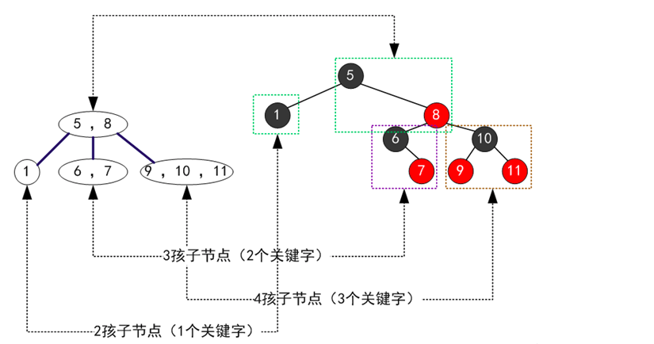

一颗红黑树对应唯一形态的2-3-4树，但是一颗2-3-4树可以对应多种形态的红黑树（主要是3节点可以对应两种不同的红黑树形态）。

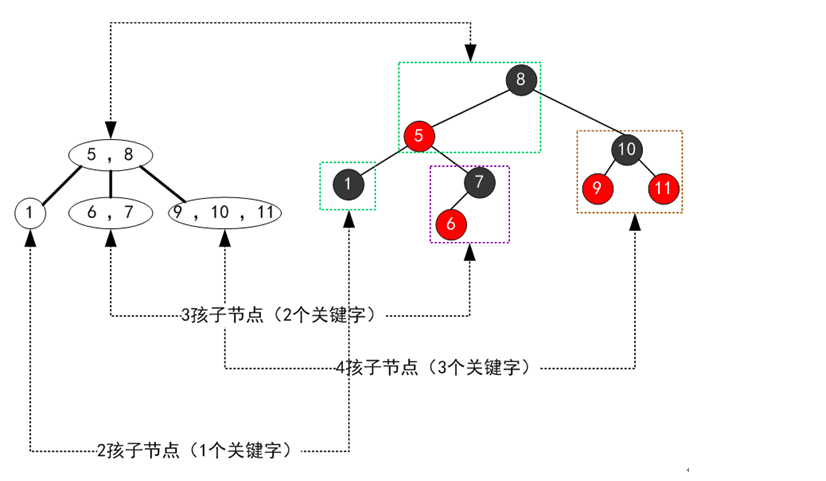

b.红黑树的插入操作:如果红黑树中已存在待插入的值，那么插入操作失败，否则一定是在叶子节点进行插入操作。

1).黑父

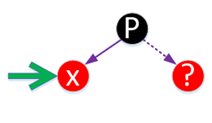

```
绿色箭头表示插入的位置，上图中的虚线表示可以有该节点，也可以没有该节点，如果有，一定是红色。
插入后直接涂红，如果父亲节点是个黑色，插入结束。
```

2).红父黑叔

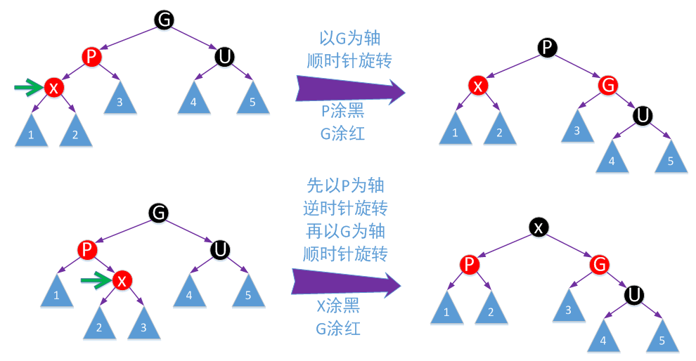

```
这种情况不会在叶子节点出现，但是会出现在回溯调整的过程中。这种情况相当于2-3-4树中，容纳进位
的父节点为3节点，还有空间可以容纳key，所以到此就不用继续回溯了。
```

3).红父红叔

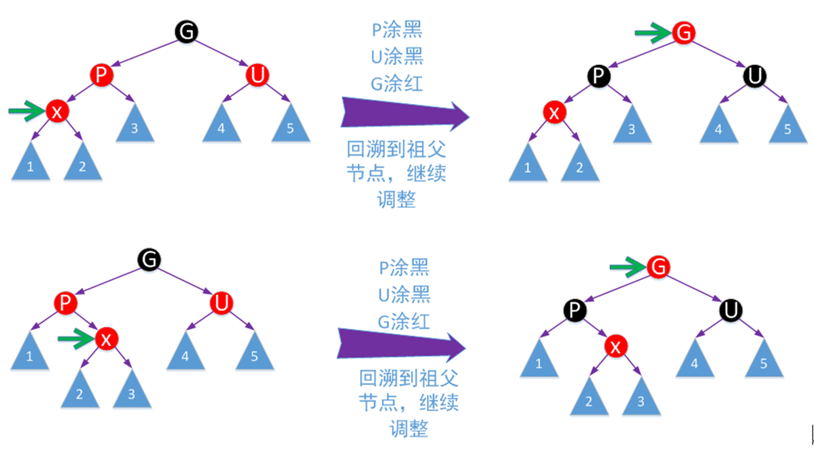

```
这种情况相当于2-3-4树中，向上进位的父节点为4节点，所以先分裂（对应P和B的颜色变换）然后再插
入X，然后继续回溯，把G看成向更上一层进位的节点（即把G看成新的X）。
```

c.红黑树的删除操作:如果要删除的节点不是叶子节点，用要删除节点的后继节点替换(只进行数据替换即可，颜色不变，此时也不需要调整结构)，然后删除后继节点。

1).要删除节点为红色

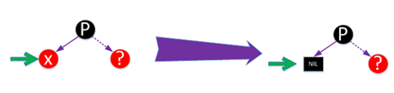

2).要删除的节点为黑色，且有一个孩子节点，这个孩子节点必然为红色

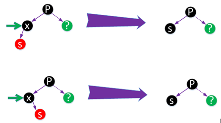

3).要删除的节点为黑色，孩子节点都NIL

3.1).黑兄红侄

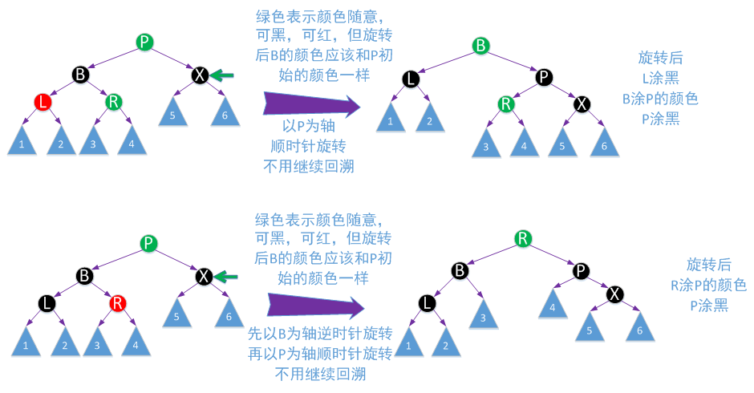

```
对应2-3-4树删除操作中兄弟节点为3节点或4节点，父节点key下移，兄弟节点key上移动，但不完全一致。
```

3.2).黑兄黑侄红父

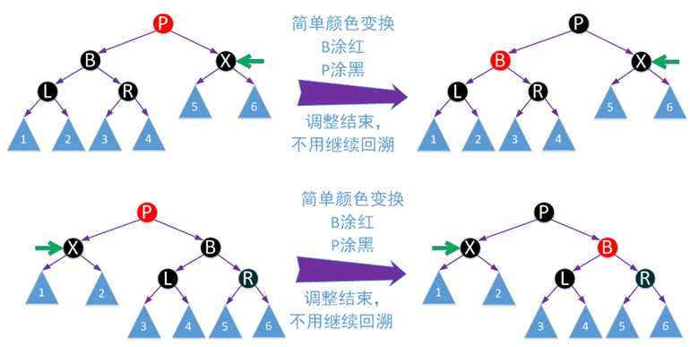

```
对应2-3-4树删除操作中兄弟节点为2节点，父节点至少是个3节点，父节点key下移与兄弟节点合并。
```

3.3).黑兄黑侄黑父

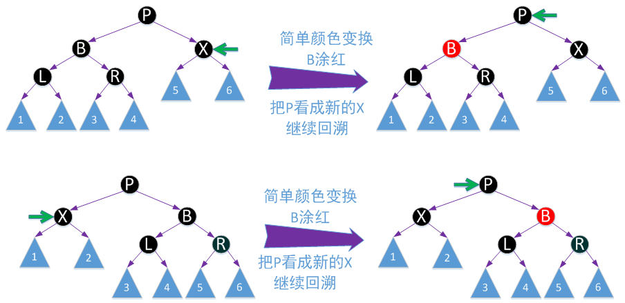

```
对应2-3-4树删除操作中兄弟节点为2节点，父亲节点也为2节点，父节点key下移与兄弟节点合并，已
父节点看成新的X，继续回溯。
```

3.4).红兄黑侄黑父

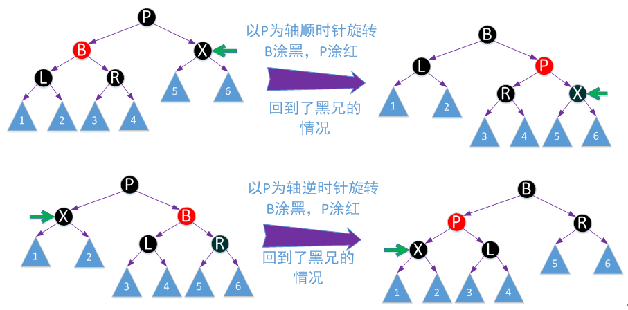
