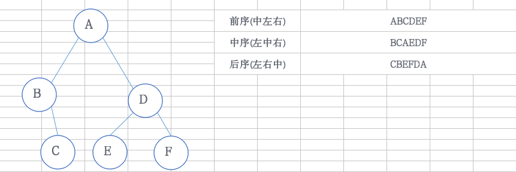

# 二叉树遍历




#### 分析

a.二叉树遍历

```
1).前序遍历:访问根节点-->遍历左子树-->遍历右子树
2).中序遍历(数据的升序过程):遍历左子树-->访问根节点-->遍历右子树
3).后序遍历:遍历左子树-->遍历右子树-->访问根节点
```

#### 源码

```cpp
struct BitNode{
	int index;
	BitNode *lchild,*rchild;
};

//先序遍历(递归)
void preOrderTraverse(BitNode* &T){
	if(T){
		cout<<T->index<<"  ";
		preOrderTraverse(T->lchild);
		preOrderTraverse(T->rchild);

	}
}

//中序遍历(递归)
void inOrderTraverse(BitNode* &T){
	if(T){
		inOrderTraverse(T->lchild);
		cout<<T->index<<"  ";
		inOrderTraverse(T->rchild);
	}
}

//后序遍历(递归)
void postOrderTraverse(BitNode* &T){
	if(T){
		postOrderTraverse(T->lchild);
		postOrderTraverse(T->rchild);
		cout<<T->index<<"  ";
	}
}
```

```cpp
struct BitNode{
    int index;
    int flag; //是否被访问过，1表示没被访问过
    BitNode *lchild,*rchild;
};

//先序遍历(非递归)，先边输出边压左节点，直到没有左节点，在将栈底的左节点(当有右节点)换成右节点，(没有右节点)出栈
void preOrderTraverse(BitNode *&T) {
    //压入根节点
    stack<BitNode *> list;
    list.push(T);
    //当栈不为空时
    while (!list.empty()) {
        BitNode *top = list.top();
        //边输出栈底元素，边压左节点
        while (top && top->flag) {
            cout << top->index << "  ";
            top->flag = 0;
            if (top->lchild && top->lchild->flag)list.push(top->lchild);
            top = top->lchild;
        }
        //当有右结点时，改变自身，否则弹出
        top = list.top();
        if (top->rchild) {
            BitNode *right = top->rchild;
            list.pop();
            list.push(right);
        } else {
            list.pop();
        }
    }
}

//中序遍历(非递归)，先压全部左节点，再输出栈底的左节点，后将栈底的左节点(当有右节点)换成右节点，(没有右节点)出栈
void inOrderTraverse(BitNode *&T) {
    //压入根节点
    stack<BitNode *> list;
    list.push(T);
    //当栈不为空时
    while (!list.empty()) {
        BitNode *top = list.top();
        //压入左元素
        while (top && top->flag) {
            if (top->lchild && top->lchild->flag)list.push(top->lchild);
            top = top->lchild;
        }
        //输出栈底元素
        top = list.top();
        if (top->flag) {
            cout << top->index << " ";
            top->flag = 0;
        }
        //当有右孩子时，改变自身，否则弹出
        if (top->rchild) {
            BitNode *right = top->rchild;
            list.pop();
            list.push(right);
        } else {
            list.pop();
        }
    }
}

//后序遍历(非递归)，先压右节点，再压左节点，后输出
void postOrderTraverse(BitNode *&T) {
    //压入根节点
    stack<BitNode *> list;
    list.push(T);
    //当栈不为空时
    while (!list.empty()) {
        BitNode *top = list.top();
        //分别压入右结点，左结点
        while (top && top->flag) {
            if (top->rchild && top->rchild->flag)list.push(top->rchild);
            if (top->lchild && top->lchild->flag)list.push(top->lchild);
            top = top->lchild;
        }
        //输出栈底元素
        top = list.top();
        if (top->flag) {
            cout << top->index << "  ";
            top->flag = 0;
            list.pop();
        }
    }
}
```
