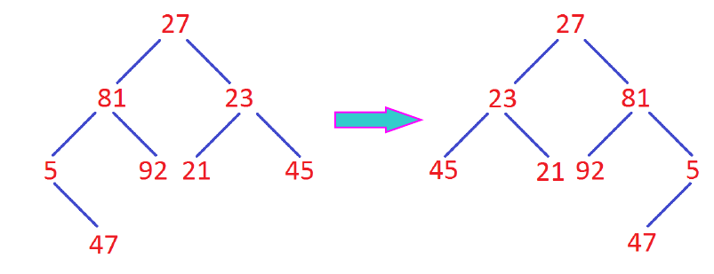

# 二叉树翻转




给定一颗二叉树，将其左右翻转。

#### 分析

a.遍历交换节点的左右结点即可。

#### 源码


```cpp
BitNode* invertTree(BitNode* root) {
    if (!root) return nullptr;
    BitNode *tmp = root->lchild;
    root->lchild = invertTree(root->rchild);
    root->rchild = invertTree(tmp);
    return root;
}
```
