# 2-3-4树

2-3-4树是一种阶为4的B树。它是一种自平衡的数据结构，可以保证在O(logN)的时间内完成查找、插入和删除操作。它主要满足以下性质:

```
1).每个节点每个节点有1、2或3个key，分别称为2（孩子）节点，3（孩子）节点，4（孩子）节点。
2).所有叶子节点到根节点的长度一致（也就是说叶子节点都在同一层）。
3).每个节点的key从左到右保持了从小到大的顺序，两个key之间的子树中所有的key一定大于它的父节
点的左key，小于父节点的右key。
```

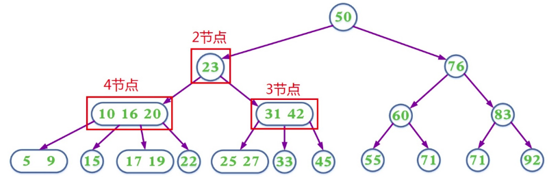

#### 分析

a.插入操作:

```
1).如果2-3-4树中已存在当前插入的key，则插入失败，否则最终一定是在叶子节点中进行插入操作
2).如果待插入的节点不是4节点，那么直接在该节点插入
3).如果待插入的节点是个4节点，那么应该先分裂该节点然后再插入。一个4节点可以分裂成一个根节
点和两个子节点(这三个节点各含一个key)然后在子节点中插入，我们把分裂形成的根节点中的key看
成向上层插入的key，然后重复第2步和第3步。
```

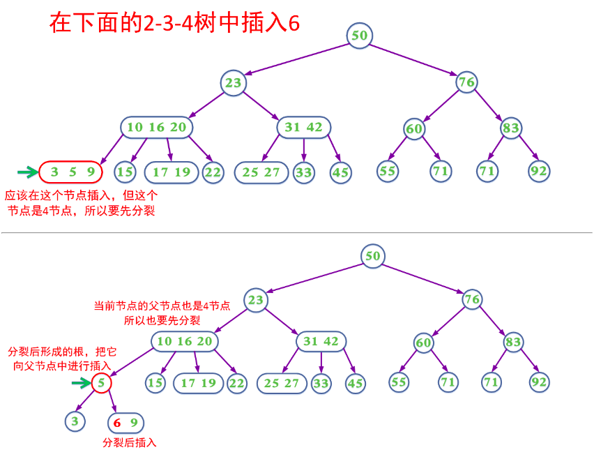
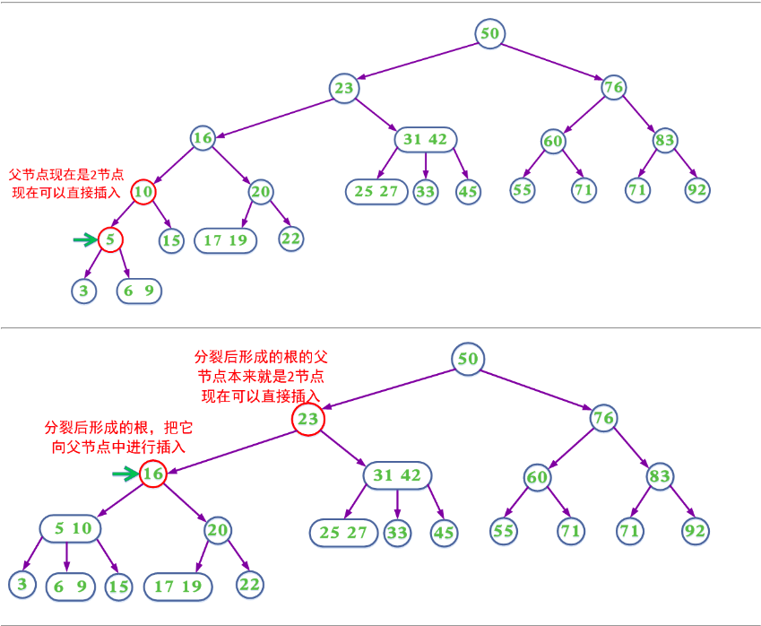
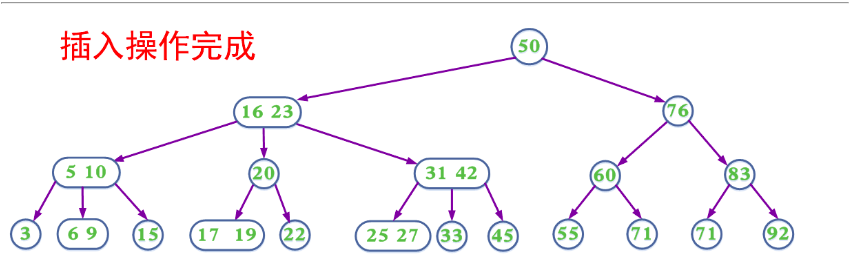

b.删除操作:

```
1).如果2-3-4树中不存在当前需要删除的key，则删除失败。
2).如果当前需要删除的key不位于叶子节点上，则用后继key覆盖，然后在它后继key所在的子支中删
除该后继key。
3).如果当前需要删除的key位于叶子节点上:
  3.1)该节点不是2节点，删除key，结束
  3.2)该节点是2节点，删除该节点：
    3.2.1).如果兄弟节点不是2节点，则父节点中的key下移到该节点，兄弟节点中的一个key上移
    3.2.2).如果兄弟节点是2节点，父节点是个3节点或4节点，父节点中的key与兄弟节点合并
    3.2.3).如果兄弟节点是2节点，父节点是个2节点，父节点中的key与兄弟节点中的key合并，形
    成一个3节点，把此节点看成当前节点（此节点实际上是下一层的节点），重复步骤3.2.1到3.2.3
```

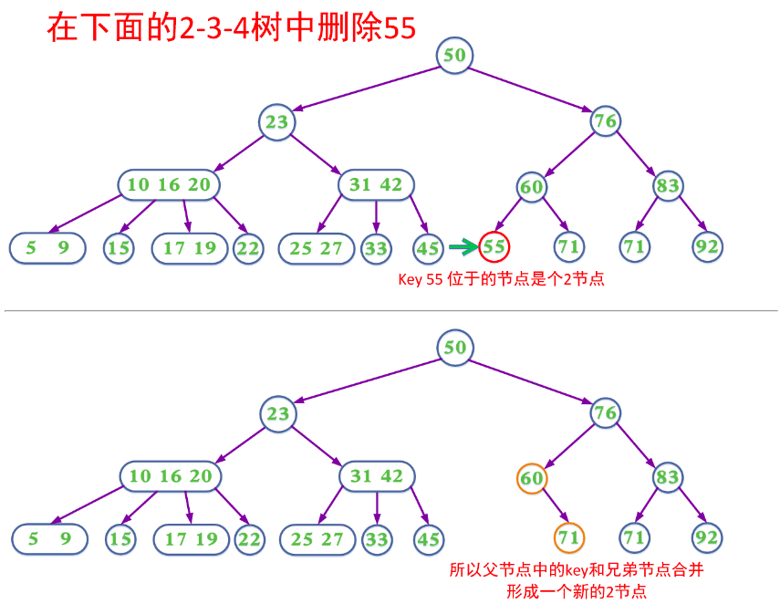
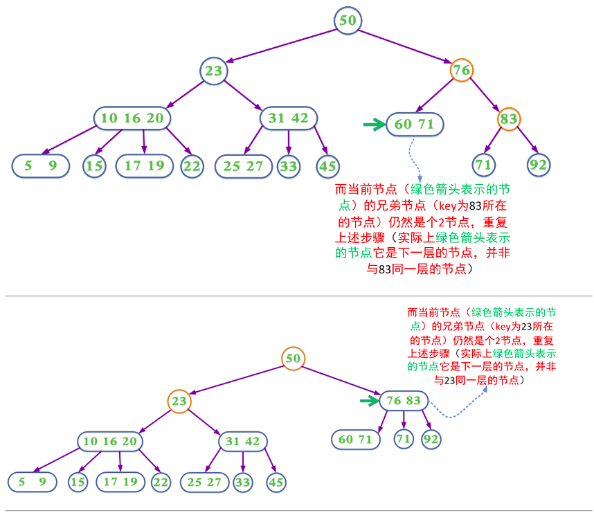
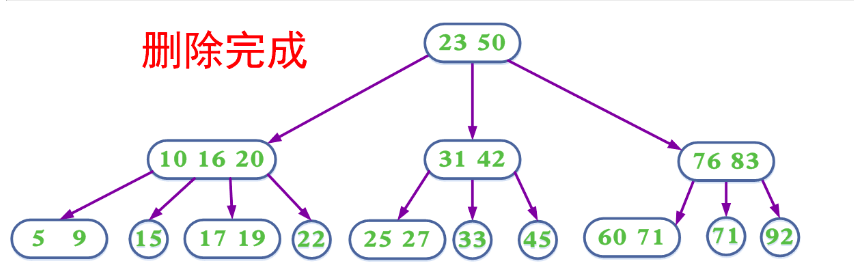

c.带有预分裂的插入操作:上面的插入以及删除操作在某些情况需要不断回溯来调整树的结构以达到平衡。为了消除回溯过程，在插入操作过程中我们可以采取预分裂的操作，即我们在插入的搜索路径中，遇到4节点就分裂，分裂后形成的根节点的key要上移，与父节点中的key合并)这样可以保证找到需要插入节点时可以直接插入(该该节点一定不是4节点)

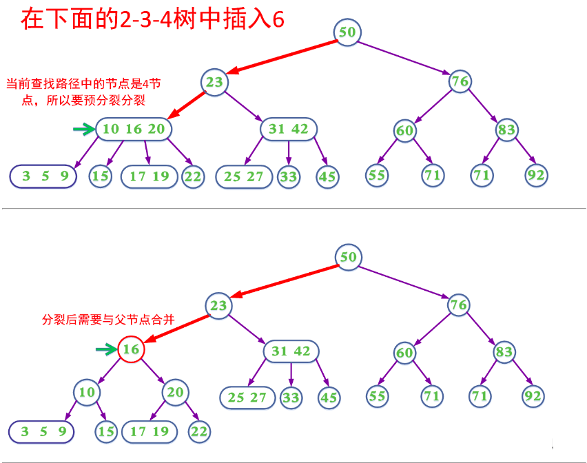
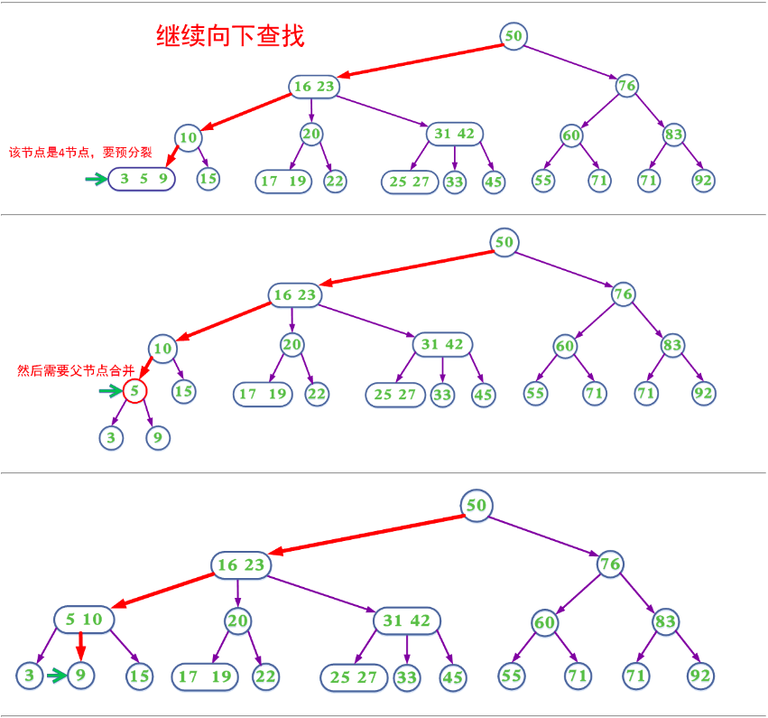
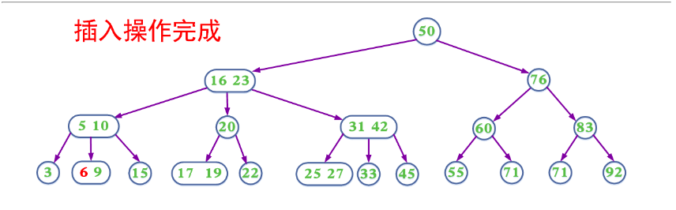

d.带有预合并的删除操作:在删除过程中，我们同样可以采取预合并的操作，即我们在删除的搜索路径中(除根节点，因为根节点没有兄弟节点和父节点)，遇到当前节点是2节点，如果兄弟节点也是2节点就合并(该节点的父节点中的key下移，与自身和兄弟节点合并)；如果兄弟节点不是2节点，则父节点的key下移，兄弟节点中的key上移。这样可以保证，找到需要删除的key所在的节点时可以直接删除(即要删除的key所在的节点一定不是2节)。

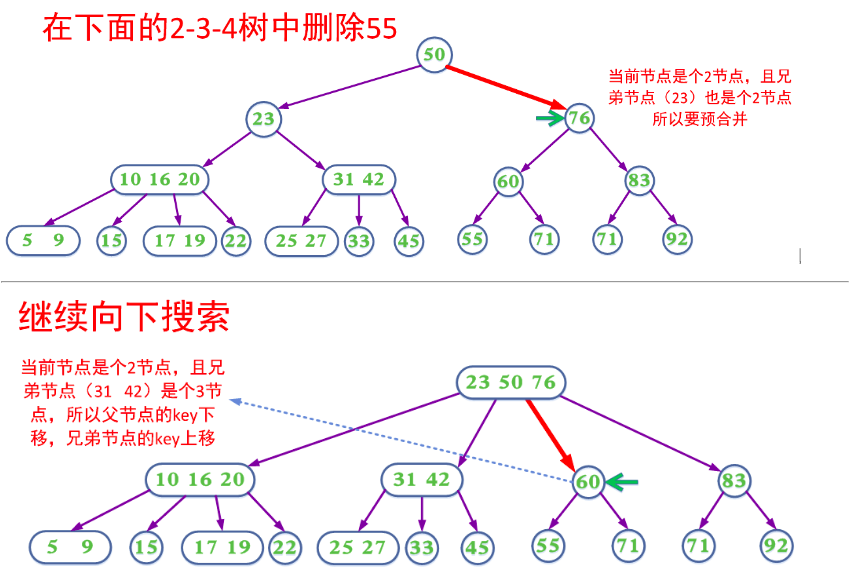
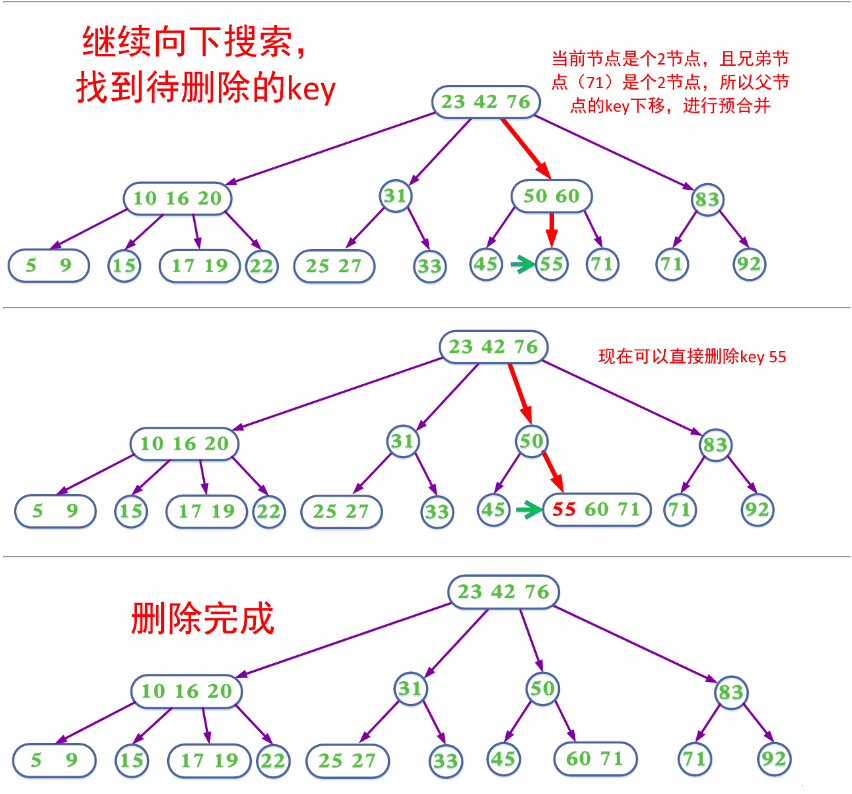
