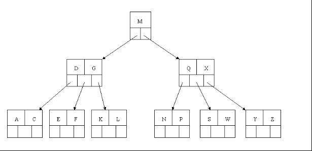
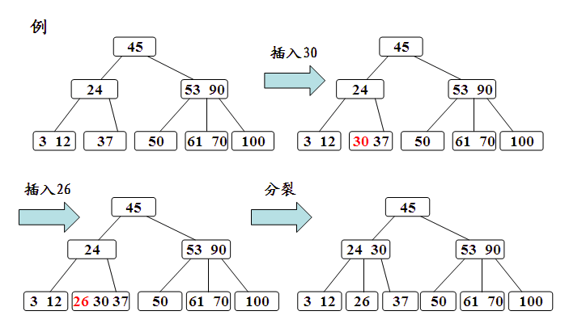
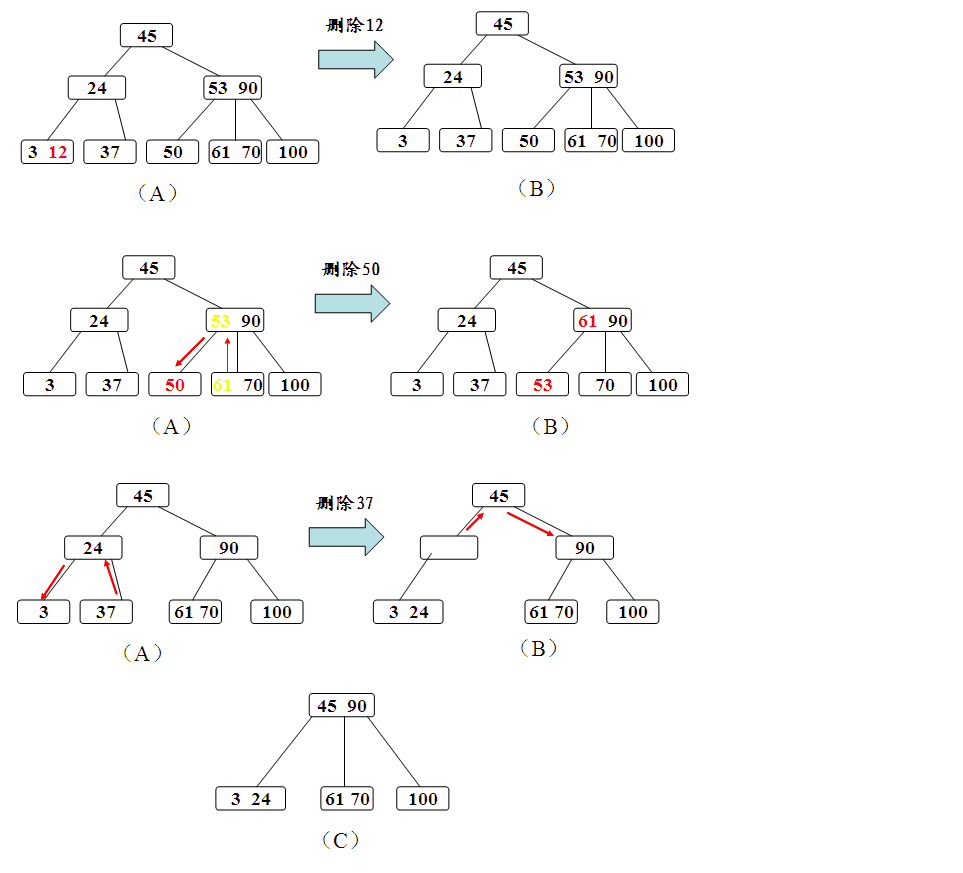
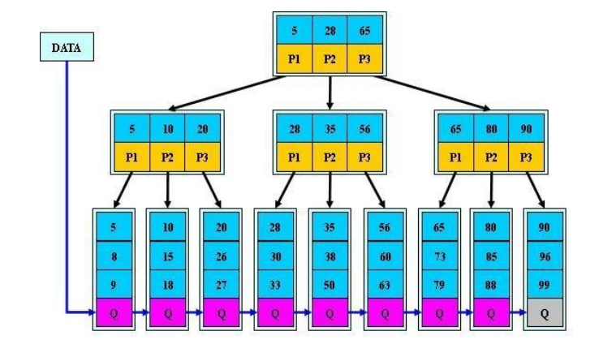

# B树


B树是一种多叉平衡查找树，红黑树是二多叉平衡查找树，B树由于是多叉结构，对于元素数量非常多的情况下，树的深度不会像二叉结构那么大，可以保证查询效率。一个m阶(一个节点的子节点数目的最大值)的B树满足以下条件：

```
1).每个结点至多拥有m棵子树；
2).根结点至少拥有两颗子树（存在子树的情况下）；
3).除了根结点以外，其余每个分支结点至少拥有 m/2 棵子树；
4).所有的叶结点都在同一层上；
5).有k棵子树的分支结点则存在k-1个关键码，关键码按照递增次序进行排列；
6).关键字数量需要满足ceil(m/2)-1 <= n <= m-1；
```



#### 分析

a.插入元素:新元素一般插在叶子节点，通过搜索找到对应的结点进行插入，那么根据即将插入的结点的数量又分为下面几种情况:

```
1).如果该结点的关键字个数没有到达m-1个，那么直接插入即可；
2).如果该结点的关键字个数已经到达了m-1个，那么根据B树的性质显然无法满足，需要将其进行
分裂。分裂的规则是该结点分成两半，将中间的关键字进行提升，加入到父亲结点中，但是这又可
能存在父亲结点也满员的情况，则不得不向上进行回溯，甚至是要对根结点进行分裂，那么整棵树
都加了一层。
```



b.删除元素:先通过搜索找到相应的值，存在则进行删除:

```
1).如果该结点拥有关键字数量仍然满足B树性质，则不做任何处理；
2).如果该结点在删除关键字以后不满足B树的性质(关键字没有到达ceil(m/2)-1的数量)，则需要
向兄弟结点借关键字，这有分为兄弟结点的关键字数量是否足够的情况。
  2.1).如果兄弟结点的关键字足够借给该结点，则过程为将父亲结点的关键字下移，兄弟结点的关键
  字上移；
  2.2).如果兄弟结点的关键字在借出去以后也无法满足情况，即之前兄弟结点的关键字的数量为
  ceil(m/2)-1，借的一方的关键字数量为ceil(m/2)-2的情况，那么我们可以将该结点合并到兄
  弟结点中，合并之后的子结点数量少了一个，则需要将父亲结点的关键字下放，如果父亲结点不满
  足性质，则向上回溯；
```




# B+树


由于B+树的数据都存储在叶子结点中，分支结点均为索引，方便扫库，只需要扫一遍叶子结点即可，且叶子节点中关键字进行有序链接,但是B树因为其分支结点同样存储着数据，我们要找到具体的数据，需要进行一次遍历按序来扫，所以B+树更加适合在区间查询的情况，所以通常B+树用于数据库索引，而B树则常用于文件索引。


