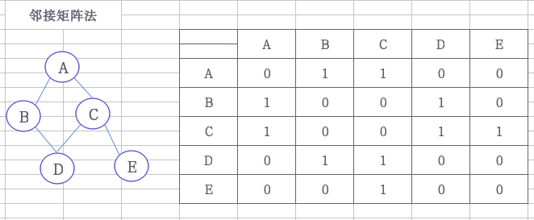
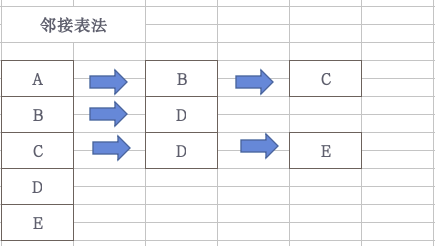

# 构造图


### 邻接矩阵



```cpp
struct Graph{
    int arcs[5][5]; //初始化5*5的矩阵,0表示不连接
    int vexnum,arcnum; //vexnum为顶点数，arcnum为边数
};

//创建无向网（带权的无向图）,邻接矩阵法
void createGraph(Graph &G) {
    int i, j, v1, v2;
    for (i = 0; i < G.vexnum; i++)
        for (j = 0; j < G.vexnum; j++)
            G.arcs[i][j] = 0;
    for (i = 0; i < G.arcnum; i++) {
        cout << i + 1 << ":v1->v2(v1 v2):";
        cin>>v1>>v2;
        G.arcs[v1][v2] = 1;
        G.arcs[v2][v1] = 1;
    }
}
```

### 邻接表法



```cpp
//链表节点定义
struct ArcNode {
    int index; //下标
    ArcNode *next; //下一节点
};

struct Graph{
    ArcNode list[5];
    int vexnum,arcnum;
};

//创建有向图，邻接表法
void createGraph(Graph &G) {
    int i, v1, v2;
    ArcNode *temp;
    //初始化链表头
    for (i = 0; i < G.vexnum; i++) {
        G.list[i].index=i;
        G.list[i].next = nullptr;
    }
    for (i = 0; i < G.arcnum; i++) {
        cout << "v1->v2(v1 v2):";
        cin>>v1>>v2;
        auto node=(ArcNode*)malloc(sizeof(ArcNode));
        node->index = v2;
        node->next = nullptr;
        temp = G.list[v1].next;
        if (temp) {
            while (temp->next) {
                temp = temp->next;
            }
            temp->next = node;
        } else {
            G.list[v1].next = node;
        }
    }
}
```
