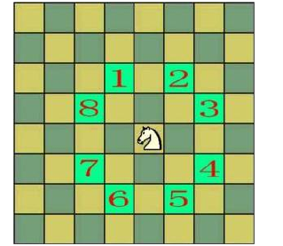

# 马踏棋盘


给定m*n的棋盘，将棋子"马"放在任意位置上，按照走棋规则将"马"移动，要求每个方格只能进入一次，最终使得"马"走遍棋盘的所有位置。

### 分析

利用深度优先搜索，若当前位置为(i,j)，则遍历(i,j)的八邻域，如果邻域尚未经过。则跳转。



### 源码

```cpp
//八邻域的移动数组
int iD[]={-2,-2,-1,+1,+2,+2,+1,-1};
int jD[]={-1,+1,+2,+2,+1,-1,-2,-2};

//判断chess[i][j]是否可以访问
bool canJump(vector<vector<int>>& chess,int i,int j){
    if((i<0)||(i>=chess.size())||(j<0)||(j>=chess.size()))
        return  false;
    return  chess[i][j]==0;
}

bool jump(vector<vector<int>>& chess,int i,int j,int step){
    //当step等于棋盘所有的格子即可退出递归
    if(step==chess.size()*chess.size())
        return true;
    //DF遍历chess[i][j]可达格子
    for(int k=0;k<chess.size();k++){
        int iCur=i+iD[k];
        int jCur=j+jD[k];
        if(canJump(chess,iCur,jCur)){
            //若可以到达chess[iCur][jCur]，更新chess[iCur][jCur]值
             chess[iCur][jCur]=step+1;
            if(jump(chess,iCur,jCur,step+1))
                return true;
            //回溯至原来状态
            chess[iCur][jCur]=0;
        }
    }
    return  false;
}
```
