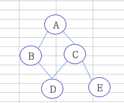
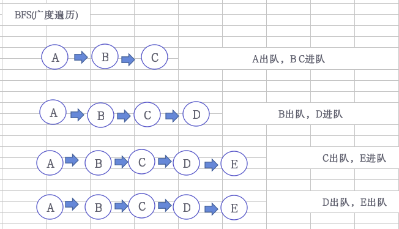
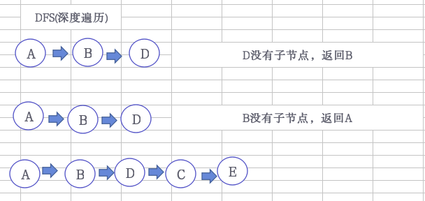

# 图的遍历




## BFS(Breadth First Search)广度优先遍历



```cpp
int visited[5] = { 0, 0, 0, 0, 0 }; //0表示没有访问，1表示访问过
int queue[5]; //初始化一个队列
int first = 0, final = 0; //列队的头，尾指针
//循环遍历
void BFS(Graph &G, int i) {
    ArcNode *temp = nullptr;
    queue[final++] = i; //进队
    visited[i]=1;
    while (final != first) {
        int v = queue[first++]; //出队
        cout << v << "-->";
        temp = G.list[v].next;
        while (temp) {
            if (!visited[temp->index]){
                queue[final++] = temp->index; //进队
                visited[temp->index]=1;
            }
            temp = temp->next;
        }
    }
}
//广度遍历
void BFSTraverse(Graph &G) {
    for (int i = 0; i < G.vexnum; i++) { //防止非连通
        if (!visited[i])
            BFS(G, i);
    }
}
```

## DFS(Depth First Search)深度优先遍历



```cpp
int visited[5] = { 0, 0, 0, 0, 0 }; //0表示没有访问，1表示访问过
//递归遍历
void DFS(Graph &G, int i) {
    ArcNode *temp = nullptr;
    visited[i] = 1;
    cout << i << "-->";
    temp = G.list[i].next;
    while (temp) {
        if (!visited[temp->index])
            DFS(G, temp->index);
        temp = temp->next;
    }
}
//深度遍历
void DFSTraverse(Graph &G) {
    for (int i = 0; i < G.vexnum; i++) { //防止非连通
        if (!visited[i])
            DFS(G, i);
    }
}
```
