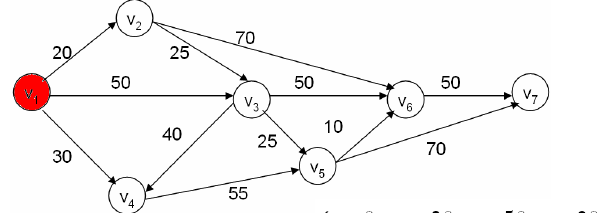
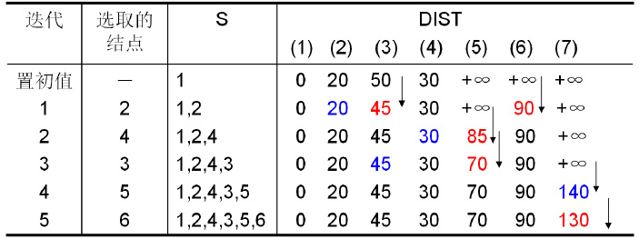
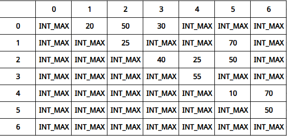
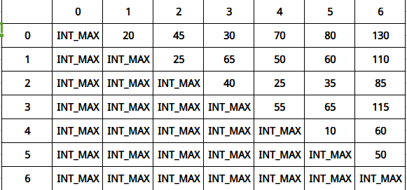
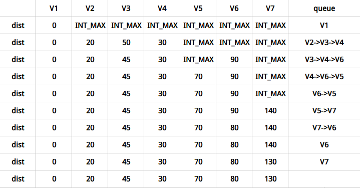

# Dijkstra算法




迪科斯彻算法使用了广度优先搜索解决加权有向图或者无向图的单源最短路径问题，算法最终得到一个最短路径树。该算法常用于路由算法或者作为其他图算法的一个子模块。



#### 分析

算法思想:Dijkstra算法采用的是一种贪心的策略，声明一个数组dist来保存源点到各个顶点的最短距离和一个保存已经找到了最短路径的顶点的集合S,初始时，原点s0的路径权重被赋为0 (dist[s0] = 0)。若对于顶点s存在能直接到达的点m，则把dist[m]设为w(s, m)，同时把所有其他(s不能直接到达的)顶点的路径长度设为无穷大。然后，又从dist中找出最小值，重复上述动作，直到S中包含了图的所有顶点。


#### 源码

```cpp
void Dijkstra(vector<vector<int>> &graph, int S, vector<int> &dist) {
    //标记结点是否访问过
    vector<bool> flag(graph.size(), false);
    //第一轮确定最小路径(S结点)
    dist = graph[S];
    dist[S] = 0;
    flag[S] = true;
    //第i轮确定最小路径
    for (size_t i = 1; i < graph.size(); i++) {
        //记录最小值mn，索引pos
        int pos = -1, mn = -1;
        //遍历寻找最小值mn，索引
        for (size_t j = 0; j < graph.size(); j++) {
            if (flag[j])
                continue;
            if ((mn < 0) || (mn > dist[j])) {
                mn = dist[j];
                pos = static_cast<int>(j);
            }
        }
        //访问最小结点pos，并更新dist
        flag[pos] = true;
        for (size_t j = 0; j < graph.size(); j++) {
            if (flag[j])
                continue;
            dist[j] = min(dist[j], dist[pos] + graph[pos][j]);
        }
    }
}
```


# Floyd算法


弗洛伊德算法是解决任意两点间的最短路径的一种算法，可以正确处理有向图或无向图或负权的最短路径问题。

#### 分析

算法思想:通过Floyd计算图各个顶点的最短路径时，需要引入矩阵D中的元素a[i][j]表示顶点i到顶点j的距离。如果图G中顶点个数为N，则需要对矩阵D进行N次更新。初始时，矩阵D中顶点a[i][j]的距离为顶点i到顶点j的权值；如果i和j不相邻，则a[i][j]=∞，接下来第1次更新时，如果a[i][j]> a[i][0]+a[0][j]，则更新a[i][j]为a[i][0]+a[0][j], 同理，第k次更新时，如果a[i][j]> a[i][k-1]+a[k-1][j]，则更新a[i][j]=a[i][k-1]+a[k-1][j]。更新N次之后，操作完成！





#### 源码

```cpp
void Floyd(vector<vector<int>> &graph,vector<vector<int>> &D){
    D=graph;
    for(size_t k = 0;k<graph.size();k++){
        for(size_t i=0;i<graph.size();i++){
            for(size_t j=0;j<graph.size();j++){
                if(D[i][j]>D[i][k]+D[k][j])
                    D[i][j]=D[i][k]+D[k][j];
            }
        }
    }
}
```


# SPFA算法


SPFA算法是求解单源最短路径问题的一种算法。它的原理是对图进行V-1次松弛操作，得到所有可能的最短路径。其优于迪科斯彻算法的方面是边的权值可以为负数、实现简单，缺点是时间复杂度过高，高达O(VE)。但算法可以进行若干种优化，提高了效率。



#### 分析

算法思路:我们用数组dist记录每个结点的最短路径估计值，设立一个先进先出的队列用来保存待优化的结点，优化时每次取出队首结点u，并且用u点当前的最短路径估计值对离开u点所指向的结点v进行松弛操作，如果v点的最短路径估计值有所调整，且v点不在当前的队列中，就将v点放入队尾。这样不断从队列中取出结点来进行松弛操作，直至队列空为止。

#### 源码

```cpp
void SPFA(vector<vector<int>> &graph, vector<int> &dist) {
    //初始化队列，dist数组
    dist[0] = 0;
    queue<int> q;
    q.push(0);
    //当栈不为空时
    while (!q.empty()) {
        //出栈
        int current = q.front();
        q.pop();
        for (size_t i = 0; i < dist.size(); i++) {
            //当dist[i]>dist[current]+graph[current][i]时，执行更新
            if (dist[i] > dist[current] + graph[current][i]) {
                dist[i] = dist[current] + graph[current][i];
                q.push(i);
            }
        }
    }
}
```
