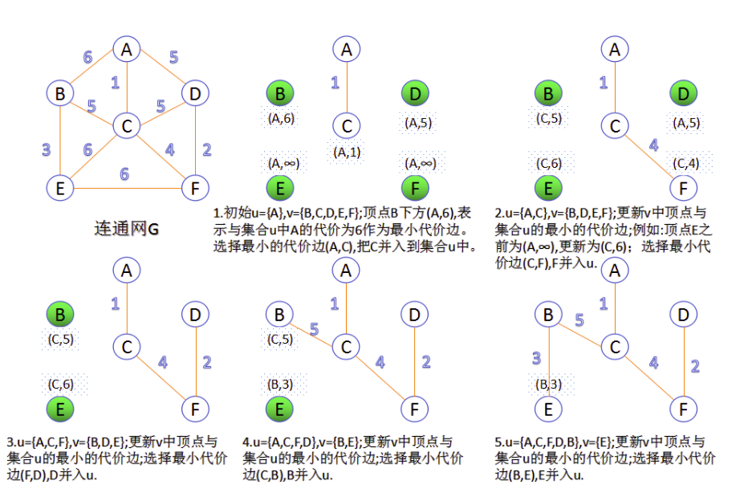
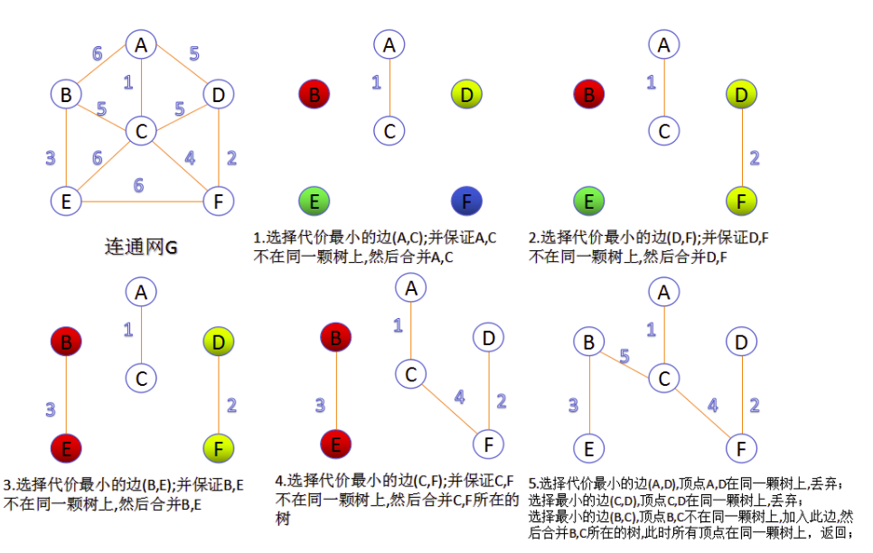

# 最小生成树


最小生成树要求从一个带权无向连通图中选择n-1条边并使这个图仍然连通(也即得到了一颗生成树)，同时还要考虑树的权最小，MST最著名的是Prim算法和Kruskal算法，他们都是贪心算法。

## Prim算法



从某个结点出发，选择与该结点邻接的权值最小的边；随着结点的不断加入，每次都选择这些结点发出的边中权值最小的，重复n-1次。

#### 分析

算法思路:首先以一个结点作为最小生成树的初始结点，然后以迭代的方式找出与最小生成树中各结点权重最小边，并加入到最小生成树中，加入之后如果产生回路则跳过这条边，选择下一个结点。当所有结点都加入到最小生成树中之后，就找出了连通图中的最小生成树。

#### 源码

```cpp
struct SEdge{
    int from;
    int to;
    int value;
    SEdge(int a,int b,int c):from(a),to(b),value(c){}
};

void Prim(vector<vector<int>> &graph, vector<SEdge *> &mst) {
    //是否已经进入u数组
    vector<bool> flag(graph.size(), false);
    //dist[i]=j:表示u数组到i的最短距离j
    vector<int> dist(graph.size());
    //from[i]=j:表示u数组到i的最短结点j
    vector<int> from(graph.size(), 0);
    //初始化源节点
    flag[0] = true;
    dist = graph[0];
    for (int i = 1; i < graph.size(); i++) {
        //寻找i到j的最短距离d，结点k
        int k = -1, d = -1;
        for (int j = 0; j < graph.size(); j++) {
            if (flag[j])
                continue;
            if ((k == -1) || (d > dist[j])) {
                d = dist[j];
                k = j;
            }
        }
        //访问结点k
        mst[i - 1] = new SEdge(from[k], k, dist[k]);
        flag[k] = true;
        //依据新的u数组更新dist数组
        for (int i = 0; i < graph.size(); i++) {
            if (!flag[i] && (dist[i] > graph[k][i])) {
                dist[i] = graph[k][i];
                from[i] = k;
            }
        }
    }
}
```

## Kruskal算法



将边按照权值递增排序，每次选择权值最小并且不构成环的边，重复n-1次。

#### 分析

算法思路:Kruskal算法将权值递增的边依次加入到最小生成树中，若加入时产生回路则跳过该边，继续尝试加入下一条边。当加入N-1条边时，则得到最小生成树。
