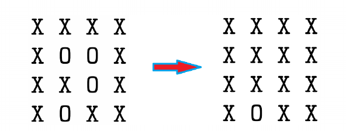

# 周围区域问题


给定M*N的二维平面，格点处要么是'X'，要么是'O'。将完全由'X'围成的区域中的'O'替换成'X'。



### 分析

a.对于每一个边界上的'O'作为起点，做若干次广度优先搜索，对于碰到的'O'，标记为其它某字符Y；

b.最后遍历一遍整个地图，把所有的Y恢复成'O'，把所有现有的'O'都改成'X'。

### 源码

```cpp
//判读land[i][j]是否为'O'
bool isOcean(vector<vector<char>>& land,int i,int j){
    if((i<0)||(i>=land.size())||(j<0)||(j>=land.size()))
        return false;
    return land[i][j]=='O';
}

//广度优先搜索land[i][j]周围的'O'结点
void ocean(vector<vector<char>>& land,int i,int j){
    //BFS搜索列队
    queue<pair<int,int>> q;
    q.push(make_pair(i,j));
    land[i][j]='Y';
    //iD[i],jD[i]:表示上下左右移动
    int iD[]={-1,1,0,0};
    int jD[]={0,0,-1,1};
    while (!q.empty()){
        //出栈操作
        i=q.front().first;
        j=q.front().second;
        q.pop();
        //移动判断周围是否存在'O',存在就标记为'Y'
        for(int k=0;k<4;k++){
            int iCur=i+iD[i];
            int jCur=j+jD[i];
            if(isOcean(land,iCur,jCur)){
                q.push(make_pair(iCur,jCur));
                land[iCur][jCur]='Y';
            }
        }
    }
}

void fillLake(vector<vector<char>>& land){
    //左右边缘
    for(int i=0;i<land.size();i++){
        if(land[i][0]=='O')
            ocean(land,i,0);
        if(land[i][land.size()-1]=='O')
            ocean(land,i, static_cast<int>(land.size()-1));
    }
    //上下边缘
    for(int j=1;j<land.size()-1;j++){
        if(land[0][j]=='O')
            ocean(land,0,j);
        if(land[land.size()-1][j]=='O')
            ocean(land, static_cast<int>(land.size()-1),j);
    }
    //将O变成X，将Y变成O
    for(int i=0;i<land.size();i++) {
        for (int j = 0; j < land.size(); j++) {
            if(land[i][j]=='O')
                land[i][j]='X';
            else if(land[i][j]=='Y')
                land[i][j]='O';
        }
    }
}
```
