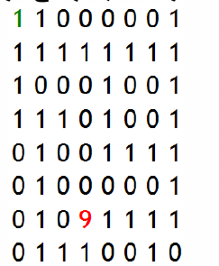

# 老鼠吃奶酪


一只老鼠位于迷宫左上角(0,0)，迷宫中的数字9处有块大奶酪，0表示墙，1表示可通过路径。试给出一条可行的吃到奶酪的路径；若没有返回空。



#### 分析

假定当前位于(i,j)处，则依次计算(i-1,j)，(i+1,j)，(i,j-1)，(i,j+1)4个相邻位置，如果相邻位置不是墙，则可以通过。

#### 源码

```cpp
bool search(vector<vector<int>> &chess, int i, int j, vector<pair<int, int>> &path, vector<vector<bool>> &visit) {
    //当找到奶酪时返回true
    if (chess[i][j] == 9)
        return true;
    //chess[i][j]左右上下移动变换数组
    int iD[] = {0, 0, -1, 1};
    int jD[] = {-1, 1, 0, 0};
    //chess[i][j]左右上下移动
    for (int k = 0; k < 4; k++) {
        int iCur = i + iD[k];
        int jCur = j + jD[k];
        if ((iCur < 0) || (iCur >= chess.size()) || (jCur < 0) || (jCur >= chess.size()))
            continue;
        //如果移动后的chess[iCur][jCur]没有被访问过且不是墙(0)，则进行DFS继续遍历
        if (!visit[iCur][jCur] && (chess[iCur][jCur] != 0)) {
            path.emplace_back(make_pair(iCur, jCur));
            visit[iCur][jCur] = true;
            //找到一条直接返回
            if (search(chess, iCur, jCur, path, visit))
                return true;
            //进行回溯
            path.pop_back();
            visit[iCur][jCur] = false;
        }
    }
    return false;
}

//老鼠吃奶酪问题
void mousePath(vector<vector<int>> &chess, vector<pair<int, int>> &path) {
    vector<vector<bool>> visit(chess.size(), vector<bool>(chess.size(), false));
    path.emplace_back(make_pair(0, 0));
    visit[0][0] = true;
    search(chess, 0, 0, path, visit);
}
```
