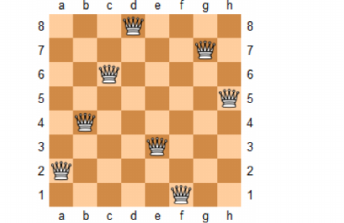

# 八皇后问题


在8*8格的国籍象棋上摆放八个皇后，使其不能互相攻击，即任意两个皇后都不能处于同一行，同一列或同一斜线上，问有多少种解法。



#### 分析

a.利用深度优先搜索:将第i个皇后放置在第j列上，如果当前位置与其它皇后互相攻击，则进行回溯到前一个皇后，进行下一次遍历。

b.分析对角线:正对角线上(i-j)为定值[-7,7]，斜对角线(i+j)为定值[0,14]，使用m_main[15],m_minor[15]数组记录皇后占据的正对角线，斜对角线。

#### 源码

```cpp
//记录被皇后占据的列
vector<bool> m_col(8, false);
//记录被皇后占据的正对角线
vector<bool> m_main(15, false);
//记录被皇后占据的斜对角线
vector<bool> m_minor(15, false);

void calcQueen(vector<vector<int>> &ret, vector<int> &path, int row) {
    //当到达最后一行+1，表示已经成功，将该path压入返回值ret中
    if (row == 8) {
        ret.emplace_back(vector<int>(path.begin(), path.end()));
        return;
    }
    //逐列进行DFS遍历
    for (int col = 0; col < 8; col++) {
        if (!m_col[col] && !m_main[row - col + 7] && !m_minor[row + col]) {
            //若该列符合要求，进行下一步遍历
            path[row] = col;
            m_col[col] = true;
            m_main[row - col + 7] = true;
            m_minor[row + col] = true;
            calcQueen(ret, path, row + 1);
            //回溯至原来状态
            m_col[col] = false;
            m_main[row - col + 7] = false;
            m_minor[row + col] = false;
        }
    }
}
```
