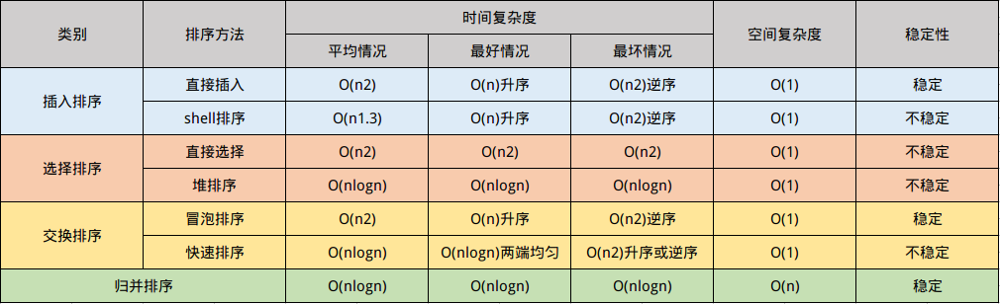

# 选择排序




## 直接选择排序

#### 源码

```cpp
//直接选择排序
void selectSort(vector<int> &arr) {
    int i, j;
    //每轮选出其中最小值，进行arr.size()-1次循环
    for (i = 0; i < arr.size() - 1; i++) {
        for (j = i + 1; j < arr.size(); j++) {
            if (arr[j] < arr[i])
                swap(arr[j], arr[i]);
        }
    }
}
```

## 堆排序

#### 源码

```cpp
//堆调整,构造堆,s需要调整的节点元素下标,len节点元素的长度
void adjustHeap(vector<int> &arr, int s, int len) {
    int rc, i;
    rc = arr[s];    //rc为s节点的记录值
    for (i = 2 * s + 1; i < len; i *= 2) {
        if (i < len - 2 && arr[i] < arr[i + 1])
            ++i;    //i为记录最大子节点的下标
        if (rc >= arr[i])
            break;    //若rc值比其子节点大于或等于则跳出循环
        arr[s] = arr[i]; //否则交换子节点与下标为s节点的位置
        s = i;        //并继续向下调整其子节点，进入下一次循环
    }
    arr[s] = rc;    //改变最后的s节点的值
}

//堆排序
void heapSort(vector<int> &arr) {
    for (int i = static_cast<int>((arr.size() - 1) / 2); i >= 0; i--) {    //从下往上构建一个新堆(大顶堆)
        adjustHeap(arr, i, static_cast<int>(arr.size()));
    }
    for (int i = static_cast<int>(arr.size() - 1); i > 0; i--) {    //排序操作
        swap(arr[0], arr[i]); //arr[0]与arr[i]交换位值
        adjustHeap(arr, 0, i);    //逐渐减小堆树的大小（i-1）并重新构建一个新堆
    }
}
```
