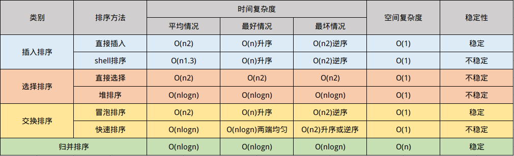

# 交换排序




## 冒泡排序

### 源码

```cpp
//冒泡排序
void bubbleSort(vector<int> &arr) {
    int i, j;
    for (i = 0; i < arr.size() - 1; i++) {
        for (j = 1; j < arr.size() - i; j++) {
            if (arr[j] < arr[j - 1])
                swap(arr[j], arr[j - 1]);
        }
    }
}
```

## 快速排序

### 源码

```cpp
//分割，返回枢纽（分割点），low为初始点,high为终点
int partion(vector<int> &arr, int low, int high) {
    int pos = arr[low];
    while (low < high) {
        while (low < high && arr[high] > pos) --high;
        arr[low] = arr[high];
        while (low < high && arr[low] <= pos) ++low;
        arr[high] = arr[low];
    }
    arr[low] = pos;
    return low;
}

//快速排序
void fastSort(vector<int> &arr, int low, int high) {
    int piv;
    if (low < high) {
        piv = partion(arr, low, high);
        fastSort(arr, low, piv - 1);
        fastSort(arr, piv + 1, high);
    }
}
```
