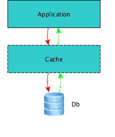
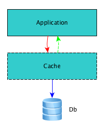
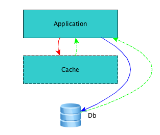

# Cache模型

**一.写操作**

(1).write-through

>发生在Cache层。缓存系统同步将数据写入缓存与数据库，成功后返回应用程序。



```
public class UserLogic{
    public void WriteToDb(UserEntity user){
        CacheManager cache = GetCacheManager();
        cache.WriteToDb(user);
    }
}

public class CacheManager{
    public void WriteToDb(UserEntity user){
        cacheStore.Set(user.cacheKey, user.ToJson());
        dbManager.UpdateSqlServer(user);
    }
}
```

(2).write-behind

>发生在Cache层，刚开始时，写入到缓存中，当设定的缓存容量达到上限，或等到一定的时间间隔后，再写到数据库中。



```
public class UserLogic{
    public void WriteToDb(UserEntity user){
        CacheManager cache = GetCacheManager();
        cache.WriteToDb(user);
    }
}

public class CacheManager{
    public void WriteToDb(UserEntity user){
        cacheStore.AddToQueue(user.cacheKey, user.ToJson());
    }
}
public class DbDaemon{
    public void Watch(){
        while(ConditionIsOK()){
            UserEntity user = cacheStore.UserDequeue();
            dbManager.WriteToDb(user);
        }
    }
}
```

(3).cache-aside

>发生在应用层，应用层保证缓存结果同DB的数据一致性，应用层来负责写入到数据库和整理缓存，缓存层则不必插手此事。



```
public class UserLogic{
    public void WriteToDb(UserEntity user){
        cacheStore.Set(user.cacheKey, user);
        dbManager.WriteToDb(user);
    }
}
```

<br>

**二.读操作**

(1).read-through

>读取数据时，先尝试从缓存中取得，如果缓存中没有，那么再从数据库中读取，而后也将数据放入缓存中，以便下次读取。

```
public class UserLogic{
    public void ReadFromDb(UserEntity user){
      if(cacheStore.Get(user.cacheKey)){
          dbManager.ReadFromDb(user);
          cacheStore.set(user.cacheKey, user)
      }
    }
}
```

(2).refresh-ahead

>简单的说就是在缓存数据过期前，能自动的刷新缓存数据。举个例子来说，某条数据在缓存中，过期时间是60秒。我们给他设置一个参数，比如是0.8，60x0.8=48秒，那么在前48秒访问该数据，就照正常的取法，直接返回缓存中的数据。当在48-60秒这个区间取数据时，缓存先将之前缓存的结果返回给外部应用程序，然后异步的再从数据库去更新缓存中的值，以尽可能的保证缓存的值是最新的。如果取数据的的时候超过了60秒，缓存数据就失效。同步更新缓存中的值

```
public class UserLogic{
    public void ReadFromDb(UserEntity user){
      if(cacheStore.Get(user.cacheKey)){
          dbManager.ReadFromDb(user);
          cacheStore.set(user.cacheKey, user)
      }
      if(cache.isNeedRefresh){
        cacheStore.reflash();
      }
    }
}
```
