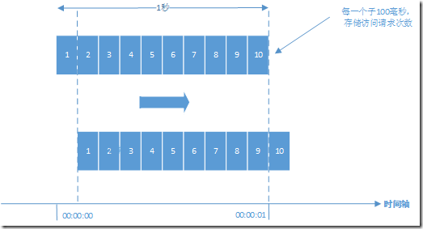

# 计数器

>计数器是最简单粗暴的算法。比如某个服务最多只能每秒钟处理100个请求。我们可以设置一个1秒钟的滑动窗口，窗口中有10个格子，每个格子100毫秒，每100毫秒移动一次，每次移动都需要记录当前服务请求的次数。如果一个滑动窗口超过指定请求数100就可以限流了。



```
//服务访问次数，可以放在Redis中，实现分布式系统的访问计数
Long counter = 0L;
//使用LinkedList来记录滑动窗口的10个格子。
LinkedList<Long> ll = new LinkedList<Long>();

public static void main(String[] args){
    Counter counter = new Counter();
    counter.doCheck();
}

private void doCheck(){
    while (true){
        ll.addLast(counter);
        if (ll.size() > 10){
            ll.removeFirst();
        }
        //比较最后一个和第一个，两者相差一秒
        if ((ll.peekLast() - ll.peekFirst()) > 100){
            //To limit rate
        }
        Thread.sleep(100);
    }
}
```
