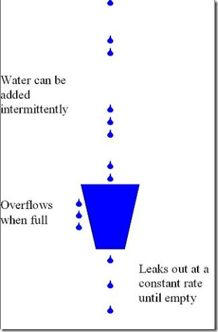

# 漏桶算法

>漏桶算法是一种非常常用的限流算法，可以用来实现流量整形(Traffic Shaping)和流量控制(Traffic Policing)，流量整形(Traffic Shaping)是一种主动调整流量输出速率的措施



```
规则:
1.一个固定容量的漏桶，按照常量固定速率流出水滴；
2.如果桶是空的，则不需流出水滴；
3.可以以任意速率流入水滴到漏桶；
4.如果流入水滴超出了桶的容量，则流入的水滴溢出了（被丢弃），而漏桶容量是不变的。
```

```
const int capacity; //桶的容量
const int irate; //每秒钟出水量
int water; //当前水量
int orate;//每秒钟进水量

public static void main(String[] args){
    LeakyBucket leaky = new LeakyBucket();
    leaky.doCheck();
}

private void doCheck(){
    while (true){
        int save=orate-irate;
        if(save>0){
          if(water+save<=capacity){
              water+=save;
              return true;
          }else{
              return false;
          }
        }
    }
}
```
