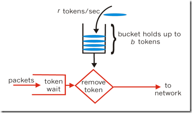

# 令牌桶算法

>令牌桶算法是一个存放固定容量令牌(token)的桶，按照固定速率往桶里添加令牌。根据放令牌的速率去控制输出的速率。令牌桶可以在运行时控制和调整数据处理的速率，处理某时的突发流量。放令牌的频率增加可以提升整体数据处理的速度，而通过每次获取令牌的个数增加或者放慢令牌的发放速度和降低整体数据处理速度。而漏桶不行，因为它的流出速率是固定的，程序处理速度也是固定的。



```
规则:
1.令牌将按照固定的速率被放入令牌桶中。比如每秒放10个。
2.桶中最多存放b个令牌，当桶满时，新添加的令牌被丢弃或拒绝。
3.当n个数据包到达，需要将从桶中删除n个令牌，接着数据包被发送到网络上。
4.如果桶中的令牌为空，则不会删除令牌，且该数据包将被限流(要么丢弃，要么缓冲区等待)。
```

```
const int capacity; //桶的容量
int irate; //每次放令牌数
int tokens; //当前令牌数
int orate;//每次拿出令牌数

public static void main(String[] args){
    TokenBucket token = new TokenBucket();
    token.doCheck();
}

private void doCheck(){
    while (true){
        int save=orate-irate;
        if(save>0){
          if(tokens+save<=capacity){
              tokens+=save;
              return true;
          }else{
              return false;
          }
        }else{
           if(save+tokens>0){
             tokens-=save;
           }else{
             return false;
           }
        }
    }
}
```
