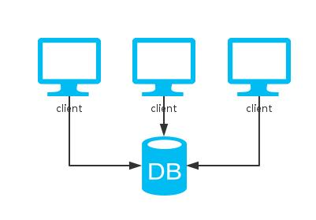
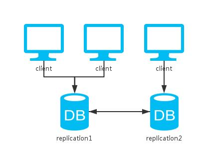
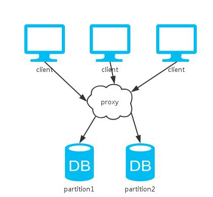
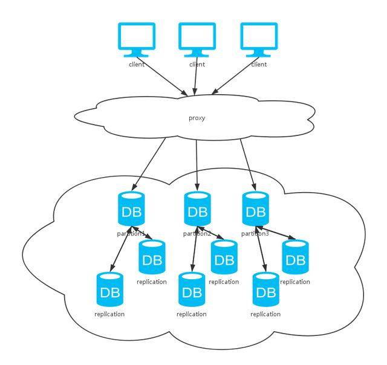

 # CAP理论

 ```
一致性(Consistency):所有节点的数据都是一样的
可用性(Availablity):在合理的时间内，用户的请求都必须响应
分区容忍性(Partition-torlerance):当节点间出现网络传输故障，尽可能多的节点还是可以响应正确的请求
 ```
(1).单实例

>单机系统只能保证CP，牺牲了可用性A。单机版的MySQL，Redis，MongoDB等数据库都是这种模式。




```
C:只有一份数据，即可以保证一致性
A:当单机系统发生宕机，不可以保证可用性
P:只有一个节点不存在节点间通信，即可以保证分区容忍性
```

(2).多副本

>多副本不能保证P



```
1.同步更新:
  请求写操作需要等待全部节点都更新成功才返回，保证C牺牲A
2.异步更新：
  请求写操作直接返回，保证A牺牲C
3.部分更新:
  请求写操作需要等待部分节点更新成功才返回，其他节点异步更新，一定程度上保证CA
```

>如Cassandra中的方案QUORUM，只要超过半数的节点更新成功便返回，读取时返回多副本的一致的值。然后选择最新数据返回，故而可以实现强一致性。强一致性不允许任何时刻返回的数据不同，弱一致性相反(最终一致性是其中一种)。


>如Redis的master-slave模式，更新成功一个节点即返回，其他节点异步去备份数据。这种方式只保证了最终一致性。最终一致性允许某段时间内数据不一致。但是随着时间的增长，数据最终会到达一致的状态。

(3).分片

>分片可以保证CP



```
C:所有数据只有一份，即可以保证一致性
A:当某些分片节点宕机，不可以保证可用性
P:分片节点间不需要通信，即可以保证分区容忍性
```

(4).集群

>集群结合副本与分片，实现BASE理论



```
Basically Available:基本可用性，即允许分区故障，出了问题仅服务降级
Soft-state:软状态，即允许异步更新
Eventual Consistency:最终一致性，允许数据最终一致性，而不是强一致性
```
