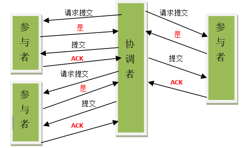

# 分布式事务

>分布式事务是指会涉及到操作多个数据库的事务。其实就是将对同一库事务的概念扩大到了对多个库的事务。目的是为了保证分布式系统中的数据一致性。分布式事务处理的关键是必须有一种方法可以知道事务在任何地方所做的所有动作，提交或回滚事务的决定必须产生统一的结果（全部提交或全部回滚）

**1.XA规范**

>分布式事务处理模型(DTP,Distributed Transaction Processing Reference Model)


```
1.传统事务:AP(应用程序)直接与RM(数据库)通过第三方数据库驱动进行通信
2.XA事务:AP(应用程序)需要通过使用TM(XA接口规范驱动，协调者)与数据库进行双向通信，用它来通知分布式数据库事务的开始、结束以及提交、回滚等
```

<br>

**2.2PC**

>二阶段提交(Two-phase Commit):参与者将操作成败通知协调者，再由协调者根据所有参与者的反馈情报决定各参与者是否要提交操作还是中止操作。

(1).准备阶段

a.协调者节点向所有参与者节点询问是否可以执行提交操作，并开始等待各参与者节点的响应

b.参与者节点执行事务操作，并将undo信息和redo信息写入日志。（注意：若成功这里其实每个参与者已经执行了事务操作）

c.参与者节点响应协调者节点。如果参与者节点的事务操作实际执行成功，则它返回一个"同意"消息；如果参与者节点的事务操作实际执行失败，则它返回一个"中止"消息

(2).提交阶段

>成功



a.协调者节点向所有参与者节点发出"正式提交(commit)"的请求

b.参与者节点正式完成操作，并释放在整个事务期间内占用的资源

c.参与者节点向协调者节点发送"完成"消息

d.协调者节点受到所有参与者节点反馈的"完成"消息后，完成事务

>失败


a.协调者节点向所有参与者节点发出"回滚操作(rollback)"的请求

b.参与者节点利用之前写入的undo信息执行回滚，并释放在整个事务期间内占用的资源

c.参与者节点向协调者节点发送"回滚完成"消息

d.协调者节点受到所有参与者节点反馈的"回滚完成"消息后，取消事务

<br>

**2.2PC的缺点**

>1.同步阻塞问题:执行过程中，所有参与节点都是事务阻塞型的。当参与者占有公共资源时，其他第三方节点访问公共资源不得不处于阻塞状态。


>2.单点故障问题:由于协调者的重要性，一旦协调者发生故障。参与者会一直阻塞下去。尤其在第二阶段，协调者发生故障，那么所有的参与者还都处于锁定事务资源的状态中，而无法继续完成事务操作。(即使重新选举一个协调者，还是无法解决因为前任协调者宕机导致的参与者处于阻塞状态的问题)


>3.数据不一致问题:在二阶段提交的阶段二中，当协调者向参与者发送commit请求之后，发生了局部网络异常或者在发送commit请求过程中协调者发生了故障，这回导致只有一部分参与者接受到了commit请求。而在这部分参与者接到commit请求之后就会执行commit操作。但是其他部分未接到commit请求的机器则无法执行事务提交。于是整个分布式系统便出现了数据部一致性的现象。


<br>

**3.3PC**

>三阶段提交(Three-phase Commit)，是二阶段提交(2PC)的改进版本，引入超时机制，在第一阶段和第二阶段中插入一个准备阶段。


(1).CanCommit阶段

a.事务询问:协调者向参与者发送CanCommit请求。询问是否可以执行事务提交操作。然后开始等待参与者的响应

b.响应反馈:参与者接到CanCommit请求之后，正常情况下，如果其自身认为可以顺利执行事务，则返回Yes响应，并进入预备状态。否则反馈No

(2).PreCommit阶段

>成功

a.发送预提交请求:协调者向参与者发送PreCommit请求，并进入Prepared阶段

b.事务预提交:参与者接收到PreCommit请求后，会执行事务操作，并将undo和redo信息记录到事务日志中

c.响应反馈:如果参与者成功的执行了事务操作，则返回ACK响应，同时开始等待最终指令

>失败

a.发送中断请求:协调者向所有参与者发送abort请求

b.中断事务:参与者收到来自协调者的abort请求之后(或超时之后，仍未收到协调者的请求)，执行事务的中断

(3).doCommit阶段

>成功

a.发送提交请求:协调接收到参与者发送的ACK响应，那么他将从预提交状态进入到提交状态。并向所有参与者发送doCommit请求

b.事务提交:参与者接收到doCommit请求之后，执行正式的事务提交。并在完成事务提交之后释放所有事务资源

c.响应反馈:事务提交完之后，向协调者发送Ack响应

d.完成事务:协调者接收到所有参与者的ack响应之后，完成事务

>失败

a.发送中断请求:协调者向所有参与者发送abort请求

b.事务回滚:参与者接收到abort请求之后，利用其在阶段二记录的undo信息来执行事务的回滚操作，并在完成回滚之后释放所有的事务资源

c.反馈结果:参与者完成事务回滚之后，向协调者发送ACK消息

d.中断事务:协调者接收到参与者反馈的ACK消息之后，执行事务的中断

>注意:在doCommit阶段，如果参与者无法及时接收到来自协调者的doCommit或者abort请求时，会在等待超时之后，会继续进行事务的提交。(因为它收到了PreCommit，意味其它参与者都同意修改了，因此默认大家都修改成功)

>3PC解决了同步阻塞问题，单点故障问题，但是还是没有解决数据一致性问题
