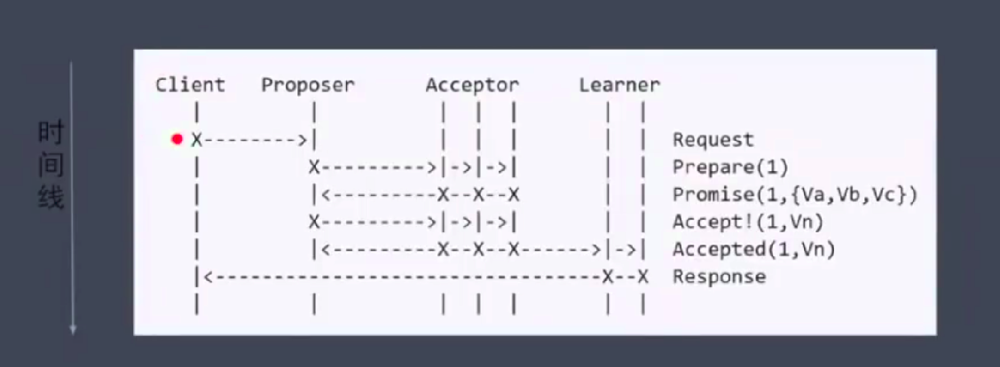
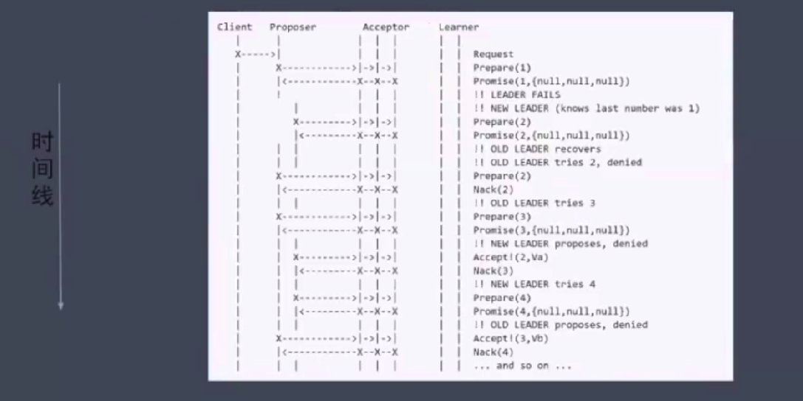
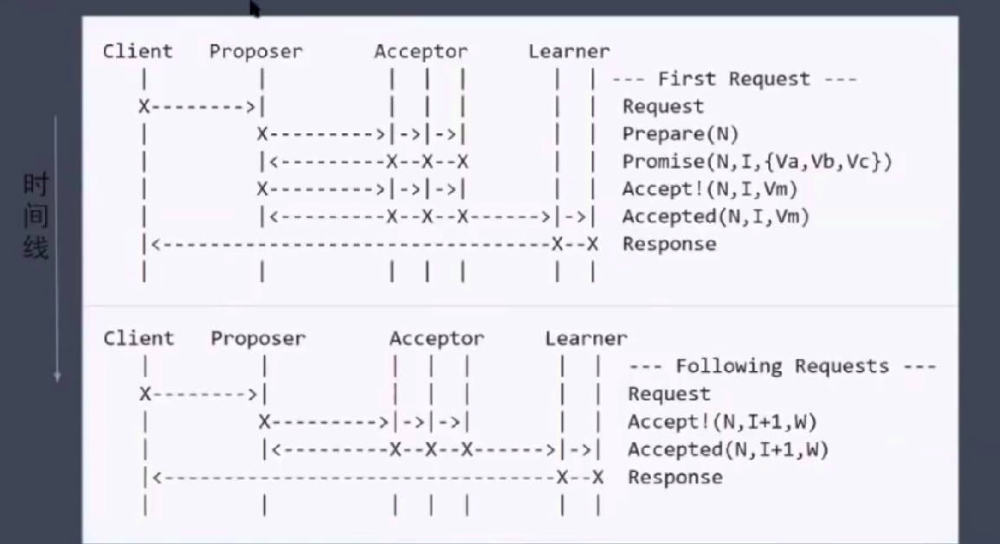
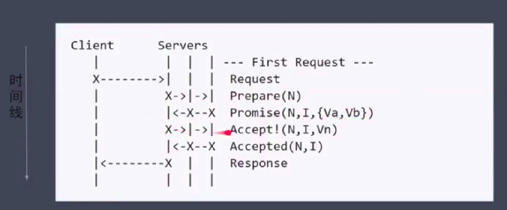

# Paxos算法(数据强一致算法)

```
倡议者(Proposer):倡议者可以提出提议(数值或者操作命令)以供投票表决
接受者(Acceptor):接受者可以对倡议者提出的提议进行投票表决，提议有超半数的接受者投票即被选中
学习者(Learner):学习者无投票权，只是从接受者那里获知哪个提议被选中，起到备份作用
```


### Basic Paxos

```
Prepare:Proposer提出一个提案，编号为N，此N大于这个Proposer之前提出提案的编号，请求Acceptor接受
Promise:如果提案编号N大于此前其他提交的提案编号，Acceptor则发送接受响应，否则发送拒绝响应
Accept:如果接受到一半以上的Acceptor的接受响应，此时发送提案编号N+提案内容
Accepted:如果Acceptor在此期间没有收到任何编号大于N的提案，则接受编号N提案内容并通知集群节点进行更新，否则忽略此提案
```



```
1.Client发出提案请求
2.Proposer接受Client发送的提案请求，向Acceptor提出提案
3.Acceptor接受提案就发送接受响应，否则发送拒绝响应
4.Proposer接受到大多数接受响应，则发送提案的内容
5.Acceptor接受提案的内容，并通知所有节点更新
6.Learner更新完毕发送已接受响应至Client
```

>活锁(liveness)问题



```
1.Client1发出提案N请求
2.Proposer1接受Client1发送的提案请求，向Acceptor提出提案N
3.Acceptor接受提案N发送接受响应
4.Proposer接受到大多数接受响应
5.Client2发送提案M请求
6.Proposer2接受Client2发送的提案请求，向Acceptor提出提案M
7.Acceptor接受提案M(M>N)发送接受响应
8.Proposer2接受到大多数接受响应
9.Proposer1又需要重复(2-4)
10.Proposer2又需要重复(6-8)
```

### Multi Paxos

>只需一轮RPC，不会产生活锁

```
Leader:唯一的Propser，所有提案请求都需要经过此Leader
```



```
1.Client发出提案请求
2.Proposer接受Client发送的提案请求，向Acceptor提出提案
3.Acceptor接受提案就发送接受响应，否则发送拒绝响应
4.Proposer接受到大多数接受响应，则发送提案的内容
5.Acceptor接受提案的内容，并通知所有节点更新
6.Learner更新完毕发送已接受响应至Client
7.Client发出提案请求
8.Proposer接受Client发送的提案请求，直接发送提案的内容
9.Acceptor接受提案的内容，并通知所有节点更新
10.Learner更新完毕发送已接受响应至Client
```

>简化版 Multi Paxos


