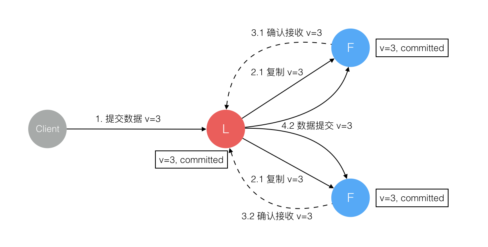

# Raft算法(数据强一致算法)

```
Leader: 处理所有客户端交互，一般一次只有一个Leader
Follower: 类似选民，完全被动
Candidate:称为下一任Leader的候选人
```

>Leader Election(Leader 选举问题)


>假设的Raft集群有三个参与者。初始状态ABC都是Follower，然后发起选举这时有三种可能情形发生。图中前二种都能选出Leader，第三种则表明本轮投票无效(Split Votes)，每方都投给了自己，结果没有任何一方获得多数票。之后每个参与方随机休息一阵(Election Timeout)重新发起投票直到一方获得多数票。这里的Election Timeout是随机数，最先从Timeout中恢复发起投票的一方向还在Timeout中的另外两方请求投票，这时它们就只能投给对方了，很快达成一致。选出 Leader后，Leader通过定期向所有Follower发送心跳信息维持其统治。若Follower一段时间未收到Leader的心跳则认为Leader可能已经挂了再次发起选主过程


>Log Replication(日志复制问题)


>当Client向集群Leader节点提交数据后，Leader节点接收到的数据处于未提交状态(Uncommitted)，接着Leader节点会并发向所有Follower节点复制数据，此时Leader确保接收到超过半数节点的已接收响应，之后Leader响应Client数据已接收，并向所有Follower发送提交数据指令，此时数据处于提交状态(Committed)


### 故障问题

(1).数据到达Leader节点，但未复制到Follower节点

>这个阶段Leader挂掉，数据属于未提交状态，Client不会收到Ack会认为超时失败可安全发起重试。Follower节点上没有该数据，重新选主后Client重试重新提交可成功。原来的Leader节点恢复后作为Follower加入集群重新从当前任期的新Leader处同步数据，强制保持和Leader数据一致。


(2).数据到达Leader节点，成功复制到Follower所有或多数节点，但还未向Leader响应接收

>这个阶段Leader挂掉，虽然数据在Follower节点处于未提交状态(Uncommitted)但保持一致，重新选出Leader后可完成数据提交，此时 Client由于不知到底提交成功没有，可重试提交。针对这种情况Raft要求 RPC请求实现幂等性，也就是要实现内部去重机制。


(3).数据到达Leader节点，成功复制到Follower少数节点，但还未向Leader响应接收

>这个阶段Leader挂掉，数据在Follower节点处于未提交状态(Uncommitted)且不一致，Raft协议要求Candidate只能是拥有最新数据的节点。所以拥有最新数据的节点会被选为Leader再强制同步数据到Follower，数据不会丢失并最终一致。


(4).数据到达Leader节点，成功复制到Follower所有或多数节点，数据在所有节点都处于已提交状态，但还未响应Client

>这个阶段Leader挂掉，Cluster内部数据其实已经是一致的，Client重复重试基于幂等策略对一致性无影响。



(5).网络分区导致的脑裂情况，出现双Leader

>网络分区将原先的Leader节点和Follower节点分隔开，Follower收不到 Leader的心跳将发起选举产生新的Leader。这时就产生了双Leader，原先的 Leader独自在一个区，向它提交数据不可能复制到多数节点所以永远提交不成功。向新的Leader提交数据可以提交成功，网络恢复后旧的Leader发现集群中有更新任期(Term)的新Leader则自动降级为Follower并从新Leader处同步数据达成集群数据一致。


