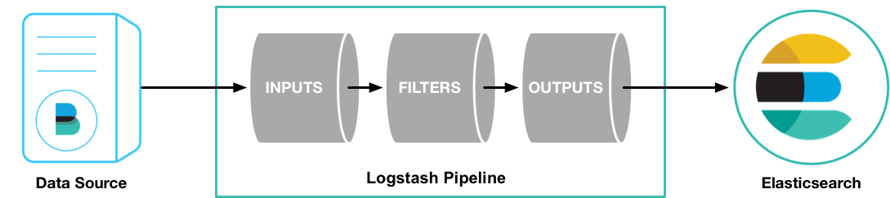

# Logstash

>Logstash是开源的服务器端数据处理管道，能够同时从多个来源采集数据、转换数据，然后将数据发送到您最喜欢的 “存储库” 中。（Elasticsearch）



#### 一.插件用法

(1).输入插件

```
input {
    # 从文件读取日志信息
    file {
        path => "/var/log/messages"
        type => "system"
        start_position => "beginning"
    }
}

# filter {
#
# }

output {
    # 标准输出
    stdout { codec => rubydebug }
}
```

(2).输出插件

```
input {
    # 从文件读取日志信息
    file {
        path => "/var/log/error.log"
        type => "error"
        start_position => "beginning"
    }

}

# filter {
#
# }

output {
    # 输出到 elasticsearch
    elasticsearch {
        hosts => ["192.168.2.41:9200"]
        index => "error-%{+YYYY.MM.dd}"
    }
}
```

(3).编码解码插件

```
>logstash-plugin install logstash-codec-multiline

input {
    # 从文件读取日志信息
    file {
        path => "/var/log/error.log"
        type => "error"
        start_position => "beginning"
        # 使用 multiline 插件
        codec => multiline {
            # 通过正则表达式匹配，具体配置根据自身实际情况而定
            pattern => "^\d"
            negate => true
            what => "previous"
        }
    }

}

# filter {
#
# }

output {
    # 输出到 elasticsearch
    elasticsearch {
        hosts => ["192.168.2.41:9200"]
        index => "error-%{+YYYY.MM.dd}"
    }
}
```

(4).过滤器插件

```
>logstash-plugin install logstash-filter-grok

input {
     stdin {}
}


filter {
     grok {
       match => { "message" => "%{IP:client} %{WORD:method} %{URIPATHPARAM:request} %{NUMBER:bytes} %{NUMBER
:duration}" }
     }
}


output {
     stdout {
        codec => "rubydebug"
     }
}
```
