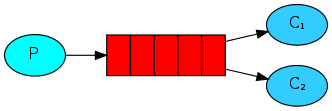
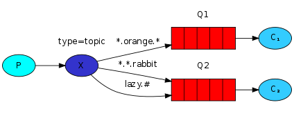

# RabbitMQ

>消息队列(Message Queue)是一种应用间的通信方式，消息发送后可以立即返回，由消息系统来确保消息的可靠传递。


>AMQP(Advanced Message Queue，高级消息队列协议):它是应用层协议的一个开放标准，为面向消息的中间件设计，基于此协议的客户端与消息中间件可传递消息，并不受产品、开发语言等条件的限制。


**一.RabbitMQ中的概念模型**


```
Publisher:消息的生产者，也是一个向交换器发布消息的客户端应用程序。

Message:消息，它由消息头和消息体组成。消息头则由一系列的可选属性组成，这些属性包括routing-key（路由键）、priority（相对于
其他消息的优先权）、delivery-mode（指出该消息可能需要持久性存储）等。

Exchange:交换器，用来接收生产者发送的消息并将这些消息路由给服务器中的队列。

Binding:绑定，用于消息队列和交换器之间的关联。一个绑定就是基于路由键将交换器和消息队列连接起来的路由规则。

Queue:消息队列，用来保存消息直到发送给消费者。

Connection:网络连接，比如一个TCP连接。

Channelz;信道，多路复用连接中的一条独立的双向数据流通道。信道是建立在真实的TCP连接内地虚拟连接，AMQP 命令都是通过信道发出
去的，不管是发布消息、订阅队列还是接收消息，这些动作都是通过信道完成。因为对于操作系统来说建立和销毁 TCP 都是非常昂贵的开
销，所以引入了信道的概念，以复用一条 TCP 连接。

Consumerz:消息的消费者，表示一个从消息队列中取得消息的客户端应用程序。

Virtual Host:虚拟主机，表示一批交换器、消息队列和相关对象。虚拟主机是共享相同的身份认证和加密环境的独立服务器域。每个
vhost 本质上就是一个 mini 版的 RabbitMQ 服务器，拥有自己的队列、交换器、绑定和权限机制。vhost 是 AMQP 概念的基础，必须在连
接时指定，RabbitMQ 默认的 vhost 是 / 。

Broker:表示消息队列服务器实体。
```

<br>

**二.Exchange类型**


```
direct 交换器

消息中的路由键（routing key）如果和 Binding 中的 binding key 一致， 交换器就将消息发到对应的队列中。它是完全匹配、单播的模
式。
```


```
fanout 交换器

每个发到fanout类型交换器的消息都会分到所有绑定的队列上去。fanout交换器不处理路由键，只是简单的将队列绑定到交换器上，每个发
送到交换器的消息都会被转发到与该交换器绑定的所有队列上。
```


```
topic 交换器

通过模式匹配分配消息的路由键属性，将路由键和某个模式进行匹配，此时队列需要绑定到一个模式上。它同样也会识别两个通配符：符
号“#”和符号“*”。#匹配0个或多个字节，*匹配一个字节。
```

<br>


**三.操作RabbitMQ**

>RabbitMQ要求集群中至少有一个磁盘节点，所有其他节点可以是内存节点，当节点加入或离开集群时，它们必须要将该变更通知到至少一个磁盘节点。如果只有一个磁盘节点，刚好又是该节点崩溃了，那么集群可以继续路由消息，但不能创建队列、创建交换器、创建绑定、添加用户、更改权限、添加或删除集群节点。换句话说集群中的唯一磁盘节点崩溃的话，集群仍然可以运行，唯有该节点恢复，否则无法更改任何东西。

```
集群配置相关命令

#关闭rabbitmq程序
>rabbitmqctl -n rabbit@cluster.com stop_app
#重置rabbitmq程序
>rabbitmqctl  -n rabbit@cluster.com reset
#在当前集群中加入某节点
>rabbitmqctl -n rabbit@cluster.com join_cluster rabbit@server.com
#启动rabbitmq程序
>rabbitmqctl -n rabbit@cluster.com start_app
#集群状态
>rabbitmqctl cluster_status
#将某节点剔除出当前集群
>rabbitmqctl -n rabbit@cluster.com  forget_cluster_node rabbit@server.com
```

```
插件管理

#开启某个插件
>rabbitmq-plugins enable {插件名}
#关闭某个插件
>rabbitmq-plugins disable {插件名}
#列出所有插件
>rabbitmq-plugins list
```

```
用户管理

#添加用户
>rabbitmqctl add_user {username} {password}
#删除用户
>rabbitmqctl delete_user {username}
#修改密码
>rabbitmqctl change_password {username} {newpassword}
#设置用户角色,tag可以为administrator, monitoring, management
>rabbitmqctl set_user_tags {username} {tag}
#列出所有用户
>rabbitmqctl list_users
#查看（指定vhost）所有用户的权限信息
>rabbitmqctl list_permissions -p /
#查看指定用户的权限信息
>rabbitmqctl list_user_permissions {username}
#清除用户的权限信息
>rabbitmqctl clear_permissions -p / {username}
#给用户设置权限(配置权限，读权限，写权限)
>rabbitmqctl set_permissions -p / root “.*” “.*” “.*”
```

```
vhost管理

#添加vhost
>rabbitmqctl add vhost {name}
#删除vhost
>rabbitmqctl delete vhost {name}
#列出vhost
>rabbitmqctl list_vhosts
```

```
获取服务器状态信息

#服务器状态
>rabbitmqctl status
#队列信息
>rabbitmqctl list_queues [-p vhostpath] [exchangeinfoitem …]
queueinfoitem可以为： name, durable, auto_delete, arguments, messages_ready, messages_unacknowled, messages, consumers, memory
#Exchange信息
>rabbitmqctl list_exchanges [-p vhostpath] [exchangeinfoitem …]
exchangeinfoitem有：name, type, durable, auto_delete, internal, arguments.
#Binding信息
>rabbitmqctl list_bindings [-p vhostpath] [bindinginfoitem …]
bindinginfoitem有：source_name, source_kind, destination_name, destination_kind, routing_key, arguments.等
#connection信息
>abbitmqctl list_connections [connectioninfoitem …]
connectioninfoitem有：recv_oct，recv_cnt，send_oct，send_cnt，send_pend等。
#channel信息
>rabbitmqctl list_channels [channelinfoitem …]
channelinfoitem有:consumer_count，messages_unacknowledged，messages_uncommitted，acks_uncommitted，messages_unconfirmed，prefetch_count，client_flow_blocked
```

<br>

**四.PHP操作(php-amqplib)**

>"Hello World"


```
require_once __DIR__ . '/vendor/autoload.php';
use PhpAmqpLib\Connection\AMQPStreamConnection;
use PhpAmqpLib\Message\AMQPMessage;

#连接服务器
$connection = new AMQPStreamConnection('localhost', 5672, 'guest', 'guest');
#创建一个通道
$channel = $connection->channel();
#声明一个列队(当不存在时会创建)
$channel->queue_declare('hello', false, false, false, false);
#发送一个消息
$msg = new AMQPMessage('Hello World!');
$channel->basic_publish($msg, '', 'hello');
#关闭通道和连接；
$channel->close();
$connection->close();
```

```
require_once __DIR__ . '/vendor/autoload.php';
use PhpAmqpLib\Connection\AMQPStreamConnection;

#连接服务器
$connection = new AMQPStreamConnection('localhost', 5672, 'guest', 'guest');
#创建一个通道
$channel = $connection->channel();
#声明一个列队(当不存在时会创建)
$channel->queue_declare('hello', false, false, false, false);
#接受消息后回调
$callback = function($msg) {
    echo "Received: ", $msg->body, "\n";
};
#监听消息列队(异步)
$channel->basic_consume('hello', '', false, true, false, false, $callback);
#循环监听
while(1) {
    $channel->wait();
}
```

>"Work Queues"



```
require_once __DIR__ . '/vendor/autoload.php';
use PhpAmqpLib\Connection\AMQPStreamConnection;
use PhpAmqpLib\Message\AMQPMessage;

#连接服务器
$connection = new AMQPStreamConnection('localhost', 5672, 'guest', 'guest');
#创建一个通道
$channel = $connection->channel();
#声明一个列队(当不存在时会创建) durable:是否持久化,避免RabbitMQ主服务器宕机，造成队列和消息丢失
$channel->queue_declare('work', false, true, false, false);
#发送一个消息(并声明消息持久化)
$msg = new AMQPMessage("Hello ".time(),array('delivery_mode' => AMQPMessage::DELIVERY_MODE_PERSISTENT));
$channel->basic_publish($msg, '', 'work');
#关闭通道和连接；
$channel->close();
$connection->close();
```

```
require_once __DIR__ . '/vendor/autoload.php';
use PhpAmqpLib\Connection\AMQPStreamConnection;

#连接服务器
$connection = new AMQPStreamConnection('localhost', 5672, 'guest', 'guest');
#创建一个通道
$channel = $connection->channel();
#声明一个列队(当不存在时会创建)
$channel->queue_declare('work', false, true, false, false);
#接受消息后回调
$callback = function($msg) {
    echo "Received: ", $msg->body, "\n";
    #模拟处理时间
    sleep(5);
};
#监听消息列队(异步) basic_consume:false为开启消息确认,避免work宕机而造成消息丢失
$channel->basic_consume('work', '', false, false, false, false, $callback);
#循环监听
while(1) {
    $channel->wait();
}
```

>Publish/Subscribe


```
require_once __DIR__ . '/vendor/autoload.php';
use PhpAmqpLib\Connection\AMQPStreamConnection;
use PhpAmqpLib\Message\AMQPMessage;

#连接服务器
$connection = new AMQPStreamConnection('localhost', 5672, 'guest', 'guest');
#创建一个通道
$channel = $connection->channel();
#声明一个交换机(不存在会新建)
$channel->exchange_declare('logs', 'fanout', false, false, false);
#发送一个消息(发送到logs交换机上)
$msg = new AMQPMessage("Hello ".time());
$channel->basic_publish($msg, 'logs');
#关闭通道和连接；
$channel->close();
$connection->close();
```

```
require_once __DIR__ . '/vendor/autoload.php';
use PhpAmqpLib\Connection\AMQPStreamConnection;

#连接服务器
$connection = new AMQPStreamConnection('localhost', 5672, 'guest', 'guest');
#创建一个通道
$channel = $connection->channel();
#声明一个交换机(当不存在时会创建)
$channel->exchange_declare('logs', 'fanout', false, false, false);
#声明一个临时列队(随机产生,一旦断开消费者，队列应该自动删除)
list($queue_name, ,) = $channel->queue_declare("");
#绑定
$channel->queue_bind($queue_name, 'logs');
#接受消息后回调
$callback = function($msg) {
    echo "Received: ", $msg->body, "\n";
};
#监听消息列队(异步)
$channel->basic_consume($queue_name, '', false, true, false, false, $callback);
#循环监听
while(1) {
    $channel->wait();
}
```

>Routing


```
require_once __DIR__ . '/vendor/autoload.php';
use PhpAmqpLib\Connection\AMQPStreamConnection;
use PhpAmqpLib\Message\AMQPMessage;

#连接服务器
$connection = new AMQPStreamConnection('localhost', 5672, 'guest', 'guest');
#创建一个通道
$channel = $connection->channel();
#声明一个交换机(不存在会新建)
$channel->exchange_declare('direct_logs', 'direct', false, false, false);
#发送一个消息(发送direct_logs交换机上,并指定routing_key为error)
$msg = new AMQPMessage("Hello ".time());
$channel->basic_publish($msg, 'direct_logs','error');
#关闭通道和连接；
$channel->close();
$connection->close();
```

```
require_once __DIR__ . '/vendor/autoload.php';
use PhpAmqpLib\Connection\AMQPStreamConnection;

#连接服务器
$connection = new AMQPStreamConnection('localhost', 5672, 'guest', 'guest');
#创建一个通道
$channel = $connection->channel();
#声明一个交换机(当不存在时会创建)
$channel->exchange_declare('direct_logs', 'direct', false, false, false);
#声明一个临时列队(随机产生,一旦断开消费者，队列应该自动删除)
list($queue_name, ,) = $channel->queue_declare("");
#绑定direct_logs交换机并指定routing_key
$channel->queue_bind($queue_name, 'direct_logs','error');
$channel->queue_bind($queue_name, 'direct_logs','info');
$channel->queue_bind($queue_name, 'direct_logs','warning');
#接受消息后回调
$callback = function($msg) {
    echo "Received: ", $msg->body, "\n";
};
#监听消息列队(异步)
$channel->basic_consume($queue_name, '', false, true, false, false, $callback);
#循环监听
while(1) {
    $channel->wait();
}
```

>Topic



```
require_once __DIR__ . '/vendor/autoload.php';
use PhpAmqpLib\Connection\AMQPStreamConnection;
use PhpAmqpLib\Message\AMQPMessage;

#连接服务器
$connection = new AMQPStreamConnection('localhost', 5672, 'guest', 'guest');
#创建一个通道
$channel = $connection->channel();
#声明一个交换机(不存在会新建)
$channel->exchange_declare('topic_logs', 'topic', false, false, false);
#发送一个消息(发送topic_logs交换机上,并指定routing_key为*.orange.*)
$msg = new AMQPMessage("Hello ".time());
$channel->basic_publish($msg, 'topic_logs','hello.orange.rabbit');
#关闭通道和连接；
$channel->close();
$connection->close();
```

```
require_once __DIR__ . '/vendor/autoload.php';
use PhpAmqpLib\Connection\AMQPStreamConnection;

#连接服务器
$connection = new AMQPStreamConnection('localhost', 5672, 'guest', 'guest');
#创建一个通道
$channel = $connection->channel();
#声明一个交换机(当不存在时会创建)
$channel->exchange_declare('topic_logs', 'topic', false, false, false);
#声明一个临时列队(随机产生,一旦断开消费者，队列应该自动删除)
list($queue_name, ,) = $channel->queue_declare("");
#绑定topic_logs交换机并指定routing_key
$channel->queue_bind($queue_name, 'topic_logs','*.orange.*');
#接受消息后回调
$callback = function($msg) {
    echo "Received: ", $msg->body, "\n";
};
#监听消息列队(异步)
$channel->basic_consume($queue_name, '', false, true, false, false, $callback);
#循环监听
while(1) {
    $channel->wait();
}
```