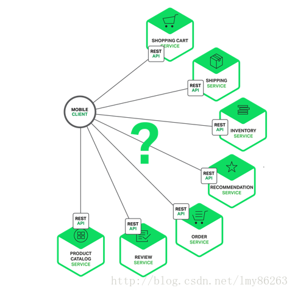
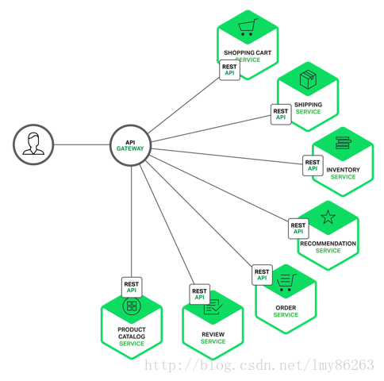

# API网关

**一.客户端和微服务直接通信问题**



(1).因为客户端的需求和每个微服务暴露出来的细粒度的API不相符，客户端可能需要发送多次请求到不同的微服务上来构成一张页面，当通过公网的时候会变得效率低下，这种方法也使得客户端代码更复杂。

(2).一些微服务可能使用了web不友好的协议。一个服务可能使用了RPC ，另外的服务可能使用AMQP消息协议。这些协议对浏览器和防火墙都不是友好的，比较适合内部使用。应用应该在防火墙外部使用类似于HTTP和WebSocket的协议。

(3).使重构微服务变得非常困难。随着时间的发展，我们可能改变系统划分服务的方法。例如，我们可能融合两个服务或者将一个服务分成两个或者多个服务。但是如果客户端直接和服务进行通信，那么完成这种重构会变得异常困难。

<br>

**二.客户端和API直接网关通信**

>API网关是一个服务器，可以作为访问系统的唯一入口。API网关封装了内部系统架构并为每个客户端量身定制了API。它也可能担负其他的责任，比如认证、监控、负载均衡、缓存、流量整形、管理和静态资源处理。



(1).API网关负责请求路由、组装以及协议翻译。所有来自客户端的请求首先进入API网关。接着网关会将该请求路由到合适的微服务中。API网关也可以通过调用多个微服务以及合并结果来处理请求。它可以在web协议比如HTTP和WebSocket、内部使用的对web不友好的协议之间转换。

(2).API网关也能为每个客户端提供定制的API。它通常向移动客户端暴露出一个粗粒度的API。可以使移动客户端在一次调用中获取所有的产品信息。

<br>

**三.实现API网关**

(1). 使用响应式编程模型

```
响应性:一个系统应该总是能够及时响应用户请求，并且保持很低的延迟。

弹性:一个系统即使在部分组件开始出现故障的情况下也应该能够作出响应，将停机时间将至最低。

可伸缩性:一个系统在负载增加时应该能够根据需求增加资源以确保响应性，但同时也应该能在负载降低时减少资源，保持高效的资源利用率。

消息驱动:在一个系统的不同部分之间传递消息，消息驱动认为这是响应式系统的一个必备特点。
```

(2).服务调用

```
一种是使用异步的，基于消息的机制。比如JMS或者AMQP。

一种是同步机制，比如HTTP或者RPC。
```

(3).服务发现

```
应用服务具有动态分配的地址。由于动态伸缩和更新，一个服务的实例可能动态改变。API网关会像系统中的其他客户端，需要使用系统的服务
发现机制，或者是服务端发现或者是客户端发现。
```

(4).处理局部故障

```
当一个服务调用其他的服务时响应很慢或者不可用时，都有可能发生。API网关不应该无限期阻塞在等待下游服务的状态中。API网关可以返回缓存
的数据，也可以返回其他代替信息，也可以返回错误代码。
```
