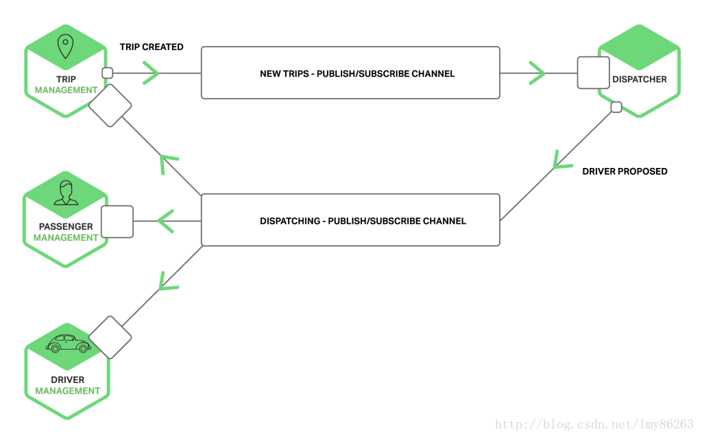

# 进程间通信

>基于微服务的应用是运行在多个机器上的分布式系统。每个服务实例都是一个单独的进程。服务必须通过进程间通信机制(IPC)来进行交互

**1.基于消息的异步通信**

(1).客户端通过发送消息来请求服务。如果服务要回复的话，也会返回给客户端一个单独的消息。因为通信是异步的，客户端不会阻塞来等待响应。代替的，客户端在开发时会假设响应不会迅速返回。

(2).一个消息包含消息头（比如发送人等元信息）和消息体。消息通过通道进行交换。任何数量的生产者都可以发送消息到一个通道中。类似的，任何数量的消费者都可以从一个通道接收消息。

(3).通道类型:

```
点对点:该通道只会将消息投送给通道中读取消息的消费者中的一个。是一对一的交互模式

发布-订阅:该通道投递消息给所有关联的消费者。是的一对多的交互模式
```



<br>

**2.基于请求/响应的同步通信**

(1).REST:是一个使用HTTP的IPC机制，REST使用HTTP的谓词来操作资源，这些资源由URL指定。

```
a.HTTP简单而熟悉；
b.直接支持请求-响应风格的通信；
c.HTTP是防火墙友好的；
d.不要求中间代理，简化了系统架构；
e.客户端必须知道每个服务实例的位置(URL)；
f.支持多种消息格式：JSON，XML；
```

(2).RPC:Thrift是用来编写跨语言RPC的客户端和服务器的框架。Thrift提供了C风格的IDL来定义你的API，可以使用Thrift编译器来生成客户端的stub和服务端的skeleton。

```
(1).Thrift方法可以有返回值，实现了请求-响应风格的交互；
(2).Thrift方法可以没有返回值，实现通知的交互模式，服务器不会返回任何响应；
(3).支持多种消息格式：JSON、二进制和紧凑二进制；
(4).可以使用原始TCP和HTTP通信；
```
