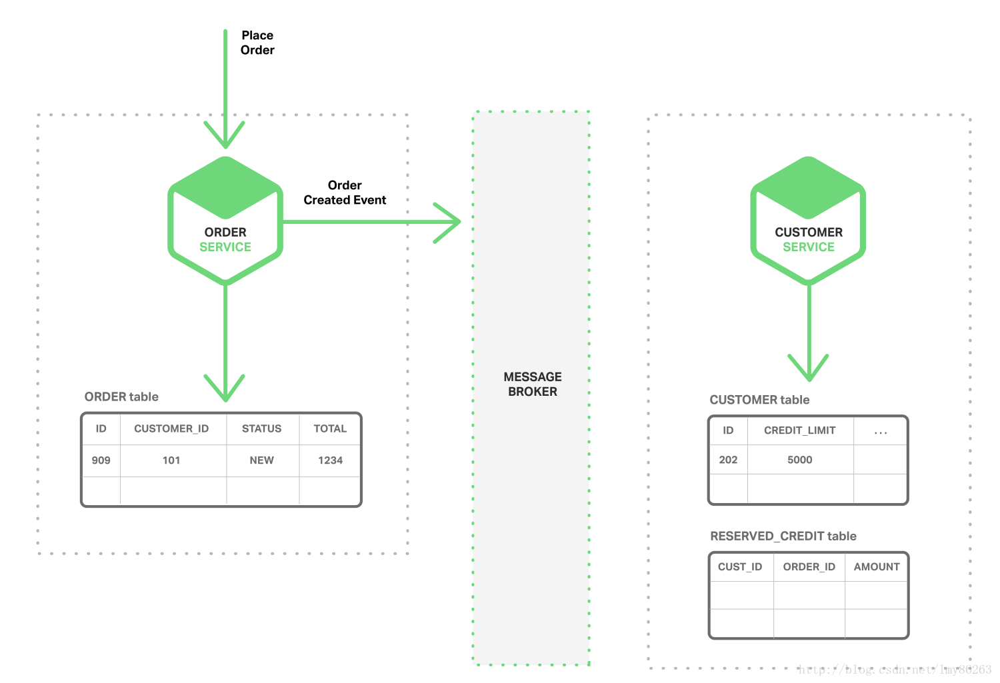
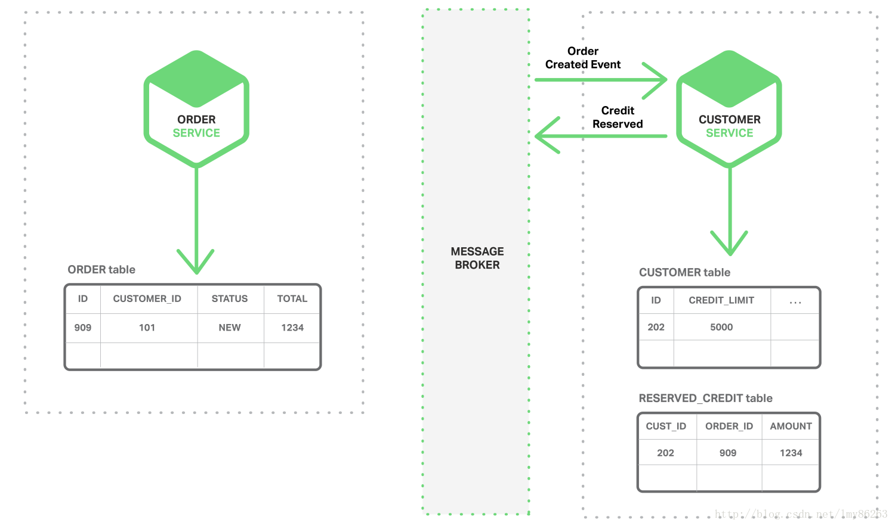
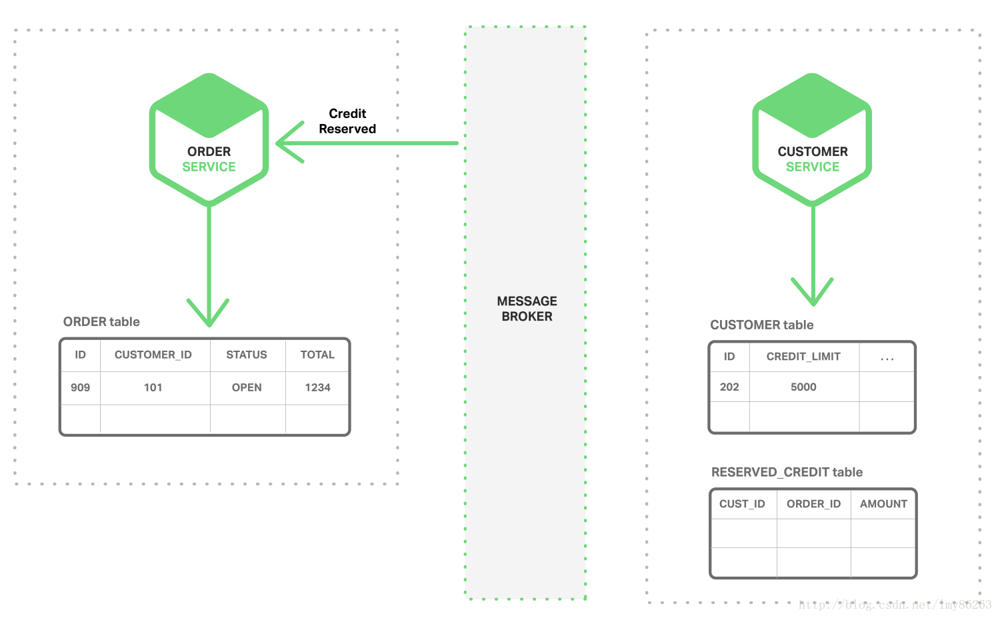
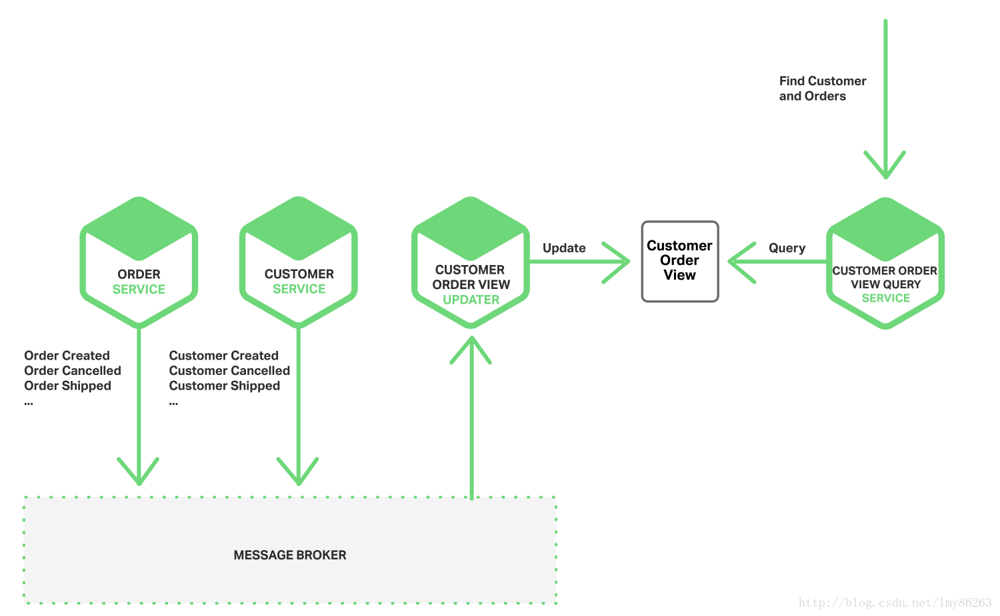
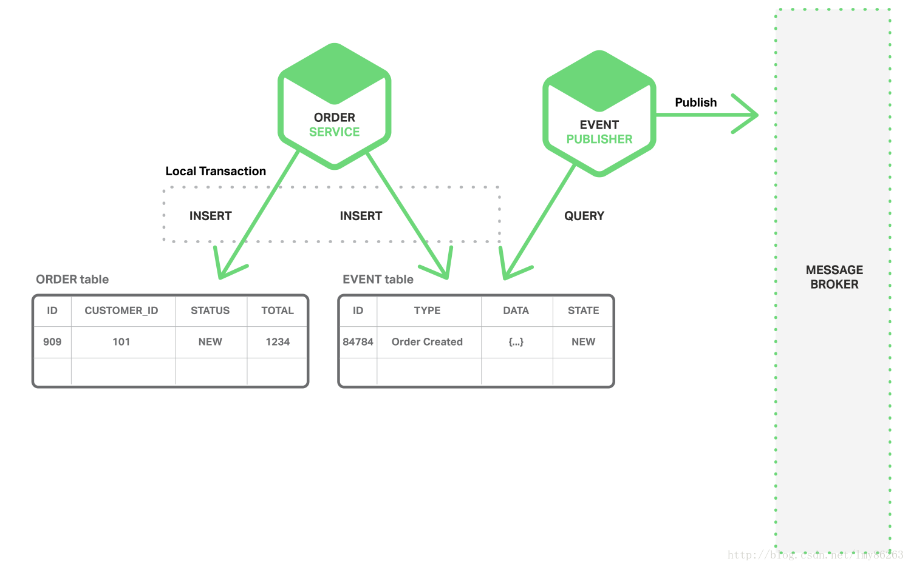
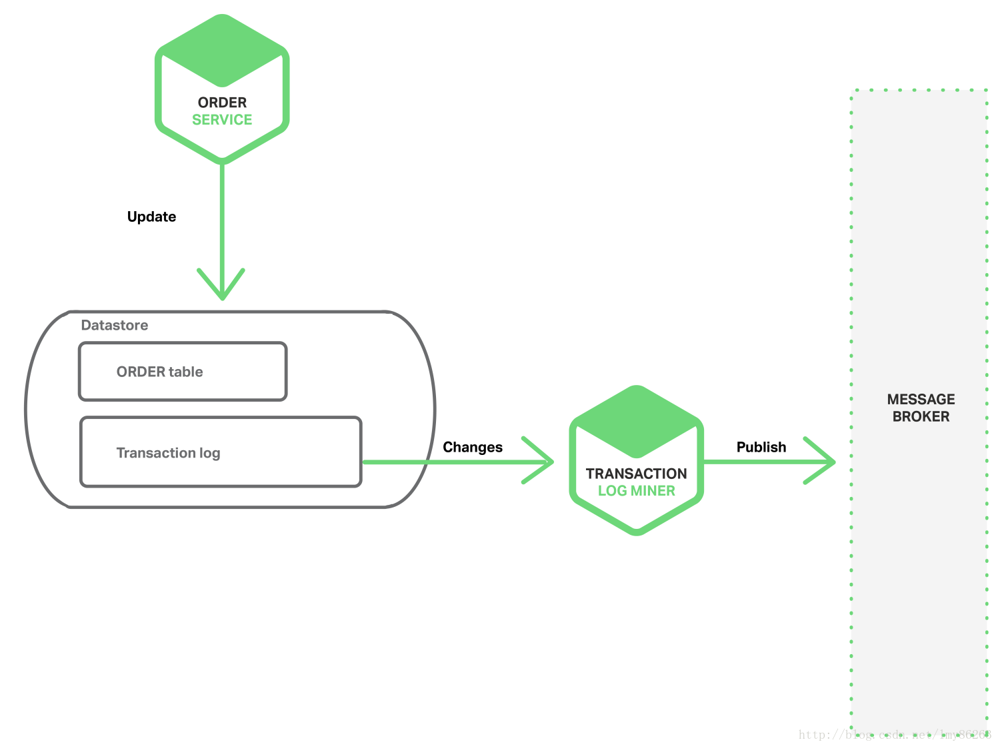
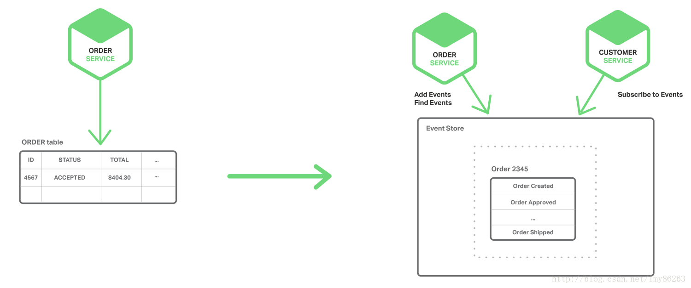

# 事件驱动的数据管理

>在微服务架构中，数据访问变得非常复杂。这是因为每个微服务拥有的数据对于该服务来说是私有的，仅能通过它的API来访问。封装数据能确保微服务之间松散耦合并且彼此之间独立发展。而且基于微服务的应用通常要混合使用SQL和NoSQL数据库【多途径持久化方法（polyglot persistence approach ）】，因此如何实现跨越多个服务且保持一致性的事务，如何实现从多种服务中查询数据成为挑战

**1.事件驱动的架构**

(1).使用事件来实现跨越多个服务的事务。注意这不是ACID事务。它们提供了更弱的保证，比如最终一致性。这个事务模型被称为BASE模型。

```
实例:
1.顾客服务维护顾客的信息，包括他们的信用额度。
2.订单服务管理订单且必须确保新订单不能超过用户的额度限制。
```

>订单服务创建状态为NEW的订单并发布"订单创建事件"



>顾客服务接受"订单创建事件"，查询该订单对应的信用剩余额度，并且发布"信用剩余额度事件"



>订单服务接受"信用剩余额度事件"，并改变订单状态为OPEN



(2).使用事件来维护一个物化视图，实现从多种服务中查询数据

```
实例:
1.应用需要展示客户和他最近的订单。
2.订单服务提供API来获取顾客的订单(Nosql)。
3.顾客服务提供API获取顾客信息(Mysql)。
4.应用首先从顾客服务处获取顾客信息，在从订单服务处获取顾客的订单。
```

>当顾客-订单视图更新服务接收"顾客服务事件"或者"订单服务事件"，它就会更新顾客-订单视图的数据存储。



<br>

**2.实现原子性**

(1).使用本地事务

这个技巧必须有一个EVENT表(充当一个消息队列，在这个数据库中存储着实体对象的状态)。应用开始本地数据库事务(begin)，插入一个事件到EVENT表中(insert)，并提交这个事务(commit)。在使用一个独立的线程或者进程来查询EVENT表，发布事件到消息代理中，接着使用本地事务来标志该事件已发布。



(2).挖掘数据库事务日志

当应用更新数据库时，数据库的事务日志中必然有该变化的记录，那么事务日志挖掘线程或者进程读取事务日志并发布事件到消息代理中。因为直接检查日志，所以不需要EVENT表。



(3).使用事件源

因为应用存储一系列状态变化事件，而不存储实体的当前状态。所以应用通过重播事件来重构实体的当前状态。无论何时实体的状态发生变化，新的事件都会被放入事件列表的末尾。保存事件是单一操作，本质上是原子操作。因此事件可以持久化到事件数据库(提供API来加入和检索实体事件)


