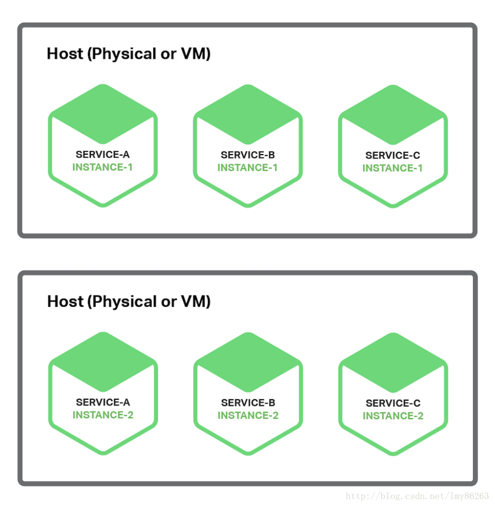
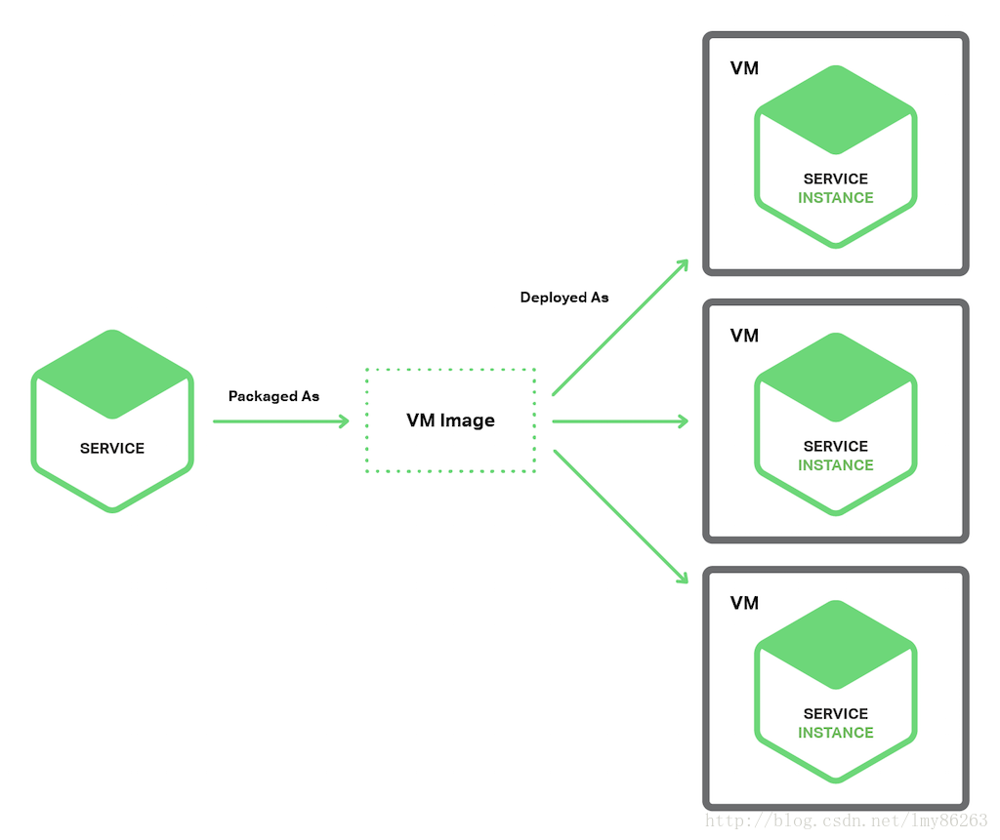
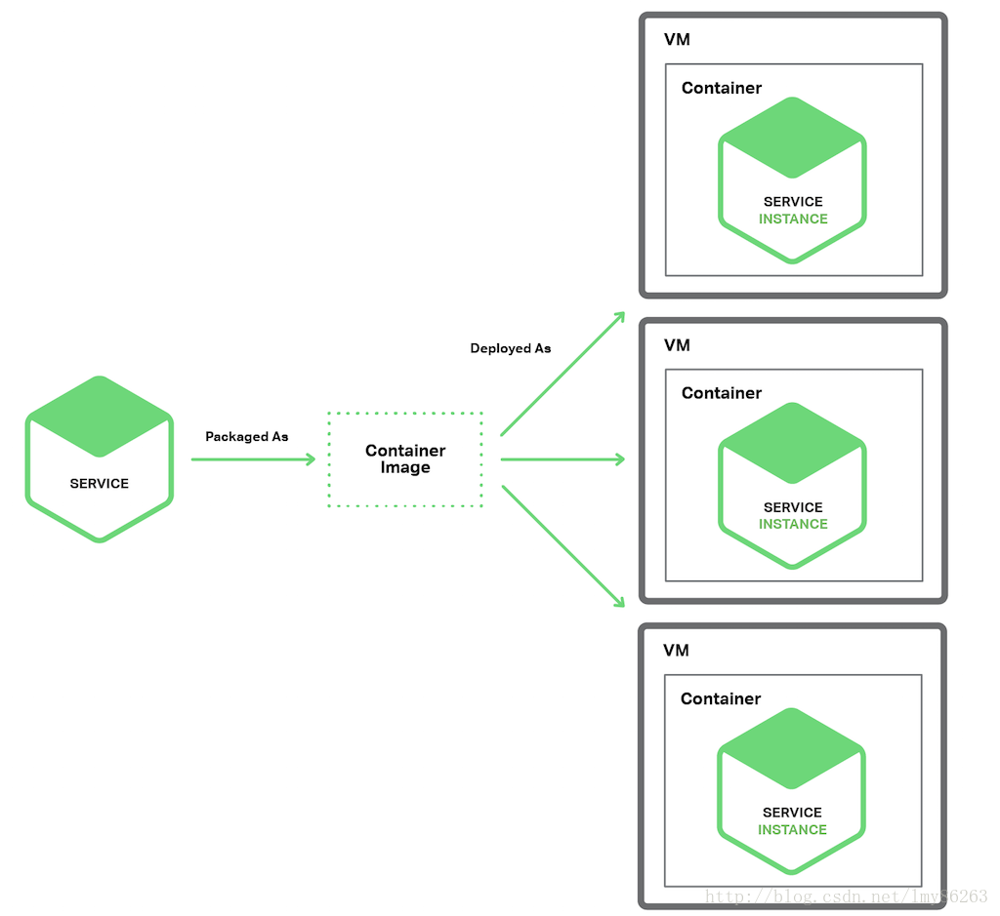

# 微服务部署策略

**1.单主机多服务实例模式**

>当使用该模式时，需要提供一个或者多个物理或者虚拟主机，并且在一个主机上运行多个服务实例。在许多方面，这仍然是应用部署的传统方式。每个服务实例运行在一个或者多个主机的端口上。这些主机通常被当做宠物。



```
a.充分利用资源，多个服务实例共享服务器和操作系统
b.部署一个服务实例相对快速，只是简单地复制该服务到一个主机并启动它即可
c.除非每个实例是单独的进程，服务实例之间几乎没有隔离，不能限制每个服务实例的资源使用
```

<br>

**2.单主机单服务实例模式**

(1).单虚拟机单服务实例模式

>当使用单虚拟机单服务实例模式时，需要将每个服务打包成虚拟机镜像，比如Amazon EC2 AMI。每个服务实例都是一个虚拟机，该虚拟机通过虚拟机镜像启动



```
a.每个服务实例完全独立运行，有固定数量的CPU和内存，不能从别的服务上盗取资源
b.资源利用率较低，每个服务实例占据整个虚拟机的全部开销
```

(2).单容器单服务实例模式

>当使用单容器单服务实例模式时，每个服务实例运行在自己的容器中。容器是操作系统级别的虚拟化机制。你可以限制容器的内存和CPU资源。一些容器的实现也有IO速率的限制。容器技术的例子包括Docker和Solaris Zones。



```
a.每个服务实例完全独立运行，有固定数量的CPU和内存，不能从别的服务上盗取资源
b.容器是轻量级的技术，容器镜像通常构建很快
c.容器仍没有达到像VM的成熟程度，并且容器也不像VM那样安全
```
