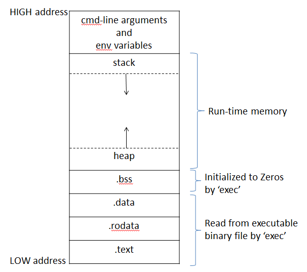

 # C内存模型




>.text:代码区(code section),由编译器链接器生成的可执行指令，程序执行时由加载器(loader)从可执行文件拷贝到内存中。为了安全考虑，防止别的区域更改代码区数据(即可执行指令)，代码区具有只读属性。另一个方面，代码区通常具有可共享性(sharable)


>.rodata:只读全局区(read-only section)，包含只读全局变量，只读静态变量，字符串字面量


>.data:可写全局区(RW section)，包括可写全局变量，可写静态变量


>.bss:未初始全局区(un-initialized section)，包括未初始化或初始化为零的全局变量，未初始化或初始化为零的静态变量。同时将这些内存空间全部初始化为零


```
.text, .rodata, .data, .bss四个区域，统称为编译时内存(compiler-time memory)，顾名思义，这些区域的大小在编译时就可以决定。
```

>heap:堆区,对于C语言而言，heap指程序运行时(run-time)由malloc, calloc, realloc等函数分配的内存


>stack:栈区,每一次函数调用，都会发生一次压栈操作，被压栈数据称为一个栈帧(stack frame)，有多少次函数调用(包括main()函数)，栈区就有多少个栈帧。相应的，每一次函数调用返回，都会相应的发生一次出栈操作，栈帧就会减少一个
