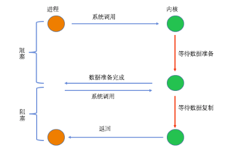

# IO模型

>1.同步:我客户端(c端调用者)一个功能，该功能没有结束前，我死等结果

>2.异步:我(c端调用者)调用一个功能，不知道该功能结果，该功能有结果后通知我，即回调通知

>3.阻塞:就是调用我(s端被调用者)，我(s端被调用者)没有完全接受完数据或者没有得到结果之前，我不会返回

>4.非阻塞:就是调用我(s端被调用者)，我(s端被调用者)立即返回，得出结果后通知调用者

### 五种I/O模型

a.阻塞I/O(Blocking I/O)

当Server进行系统调用(Server开始阻塞)时，内核开始第一个阶段，等待Client请求并接受请求数据到内核区，第二个阶段将数据从内核区拷贝到用户区，这时Server才解除阻塞重新运行

b.非阻塞I/O(Non-Blocking I/O)

当Server进行系统调用(Server开始阻塞)时，内核开始第一个阶段，等待Client请求并接受请求数据到内核区，这时内核立刻回复Server是否成功(Server解除阻塞)，若失败则Server隔一段时间继续轮询内核，若成功(Server开始阻塞)内核进行第二个阶段将数据从内核区拷贝到用户区，这时Server才解除阻塞重新运行

c.I/O复用(I/O Multiplexing)

当Server进行系统调用(Server开始阻塞)时，内核开始第一个阶段，等待多个Client请求并接受请求数据到内核区，若某个请求成功内核进行第二个阶段将数据从内核区拷贝到用户区，这时Server才解除阻塞重新运行

d.信号驱动的I/O(Signal Driven I/O)

当Server进行系统调用时，Server立即返回，内核开始第一个阶段，等待Client请求并接受请求数据到内核区，若成功内核通知Server，内核进行第二个阶段(Server开始阻塞)将数据从内核区拷贝到用户区，这时Server才解除阻塞重新运行

e.异步I/O(Asynchrnous I/O)

当Server进行系统调用时，Server立即返回，内核开始第一个阶段，等待Client请求并接受请求数据到内核区，内核进行第二个阶段将数据从内核区拷贝到用户区，若成功内核通知Server

### I/O多路复用技术

select

(1).select的机制中提供一fd_set的数据结构，每一个元素都能与一个socket句柄建立联系，建立联系的工作由程序员完成， 当调用select时，由内核根据IO状态修改fd_set的内容，由此来通知执行了select的进程哪一个socket可读或可写

(2).程序执行select后，如果没有数据发送，程序会一直等待(阻塞)，直到有数据为止，也就是程序中无需循环

(3).每次调用select，都需要把fd_set集合从用户态拷贝到内核态，内核轮询遍历fd_set集合，在将fd_set集合从内核态返回到用户态，这个开销在fd_set很多时会很大

(4).select支持的文件描述符数量太小了，默认是1024

poll

(1).poll的实现和select非常相似，只是描述fd_set集合的方式不同，poll使用pollfd链表结构而不是select的fd_set结构，其他的都差不多

(2).监视描述符个数无上限

epoll/kqueue

(1).监视描述符个数无上限

(2).事件驱动不需要轮询，epoll/kqueue只返回活跃的文件描述符

(3).内存拷贝，利用mmap文件映射内存加速与内核空间的消息传递

(4).epoll支持水平触发与边缘触发

(5).水平触发(Level Triggered):如果用户进程未处理完接受的数据，则在次调用epoll时又会返回上次未处理完的数据

(6).边缘触发(Edge Triggered):如果用户进程未处理完接受的数据，则在次调用epoll时会阻塞，直到有新请求到来，返回上次未处理完的数据与新数据
