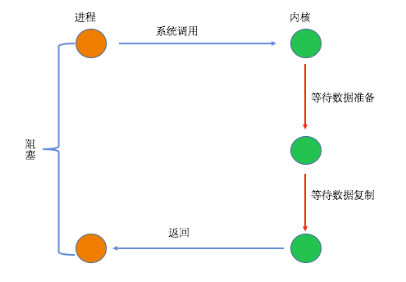
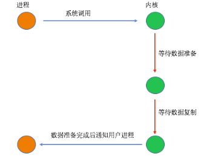

# IO模型

>1.同步:我客户端（c端调用者）一个功能，该功能没有结束前，我死等结果.

>2.异步:我（c端调用者）调用一个功能，不知道该功能结果，该功能有结果后通知我，即回调通知

>3.阻塞:就是调用我（s端被调用者，函数），我（s端被调用者，函数）没有完全接受完数据或者没有得到结果之前，我不会返回。

>4.非阻塞:就是调用我（s端被调用者，函数），我（s端被调用者，函数）立即返回，得出结果后通知调用者

**五种I/O模型**

(1) 阻塞I/O (Blocking I/O)

当用户进程进行系统调用时，内核就开始了I/O的第一个阶段，准备数据到缓冲区中，当数据都准备完成后，则将数据从内核缓冲区中拷贝到用户进程的内存中，这时用户进程才解除block的状态重新运行。

(2) 非阻塞I/O (Non-Blocking I/O)

用户进程只有在第二个阶段被阻塞了，而第一个阶段没有阻塞，但是在第一个阶段中，用户进程不需要盲等，不停的去轮询内核，看数据是否准备好了，因此该模型是比较消耗CPU的。

(3) I/O复用（I/O Multiplexing)

I/O执行的两个阶段都是用户进程都是阻塞的，但是两个阶段是独立的，在一次完整的I/O操作中，该用户进程是发起了两次系统调用。和阻塞I/O不同的是第一段可以等待多个描述符就绪

(4) 信号驱动的I/O (Signal Driven I/O)

只有在I/O执行的第二阶段阻塞了用户进程，而在第一阶段是没有阻塞的。该模型在I/O执行的第一阶段，当数据准备完成之后，会主动的通知用户进程数据已经准备完成，即对用户进程做一个回调。

(5) 异步I/O (Asynchrnous I/O)

当用户进程发起系统调用后，立刻就可以开始去做其它的事情，然后直到I/O执行的两个阶段都完成之后，内核会给用户进程发送通知，告诉用户进程操作已经完成了。

**I/O多路复用技术**

select

(1).select的机制中提供一fd_set的数据结构，每一个元素都能与一个socket句柄建立联系，建立联系的工作由程序员完成， 当调用select时，由内核根据IO状态修改fd_set的内容，由此来通知执行了select的进程哪一个socket可读或可写。

(2).程序执行select后，如果没有数据发送，程序会一直等待(阻塞)，直到有数据为止，也就是程序中无需循环。

(3).每次调用select，都需要把fd_set集合从用户态拷贝到内核态，内核轮询遍历fd_set集合，在将fd_set集合从内核态返回到用户态，这个开销在fd_set很多时会很大。

(4).select支持的文件描述符数量太小了，默认是1024

poll

(1).poll的实现和select非常相似，只是描述fd_set集合的方式不同，poll使用pollfd链表结构而不是select的fd_set结构，其他的都差不多。

(2).监视描述符个数无上限；

epoll/kqueue

(1).监视描述符个数无上限；

(2).效率提升，不是轮询的方式，不会随着fd数目的增加效率下降。只有活跃可用的fd才会调用callback函数；即epoll/kqueue只返回活跃的文件描述符；

(3).内存拷贝，利用mmap文件映射内存加速与内核空间的消息传递；

(4).epoll支持水平触发与边缘触发；

(5).水平触发(Level Triggered):如果用户进程未处理完接受的数据，则在次调用epoll时又会返回上次未处理完的数据

(6).边缘触发(Edge Triggered):如果用户进程未处理完接受的数据，则在次调用epoll时会阻塞，直到有新情求到来，返回上次未处理完的数据与新数据
