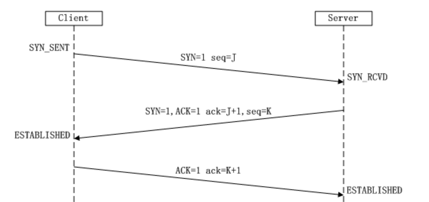
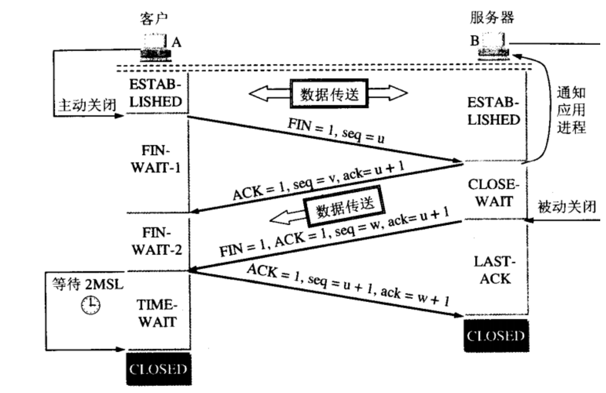

 # TCP

 #### 一.TCP的连接建立

a).Client向Server发出连接请求报文，其首部SYN=1，seq=J，Client进入SYN-SENT状态

b).Server收到连接请求报文，如果同意连接，就发送确认报文。其首部ACK=1，ack = J+1，SYN=1，seq = K，Server进入SYN-REVD状态

c).Client收到确认报文后，还要向Server发出确认报文，其首部ACK=1，ack=K+1，seq=J+1，Client进入ESTABLISHED状态

d).Server收到确认报文后，Server进入ESTABLISHED状态



#### 二.三次握手原因

```
第一次：首先A发送一个(SYN)到B，意思是A要和B建立连接进行通信；
 如果是只有一次握手的话，这样肯定是不行的，A压根都不知道B是不是收到了这个请求。
 
第二次：B收到A要建立连接的请求之后，发送一个确认(SYN+ACK)给A，意思是收到A的消息了，B这里也是通的，表示可以建立连接；
 如果只有两次通信的话，这时候B不确定A是否收到了确认消息，有可能这个确认消息由于某些原因丢了。
 
第三次：A如果收到了B的确认消息之后，再发出一个确认(ACK)消息，意思是告诉B，这边是通的，然后A和B就可以建立连接相互通信了；
 这个时候经过了三次握手，A和B双方确认了两边都是通的，可以相互通信了，已经可以建立一个可靠的连接，并且可以相互发送数据。
```

<br>

#### 三.TCP的连接释放

a).Client向Server发出连接释放报文，并停止发送数据。其首部FIN=1，seq=u，Client进入FIN_WAIT1状态

b).Server收到连接释放报文后，如果同意释放，就发送确认报文，其首部ACK=1，ack = u+1，seq=v，Server进入CLOSE-WAIT状态

c).Client收到确认报文后，进入FIN_WAIT2状态

d).Server向Client发出连接释放报文，并停止发送数据，其首部FIN=1，seq=w，ACK=1，ack=u+1，Server进入LAST-ACK状态

e).Client收到连接释放报文后，发送确认报文，其报文首部ACK=1，ack=w+1，seq=u+1，Client进入TIME-WAIT状态

f).Server收到确认报文后，进入CLOSED状态，Client等到2MSL后进入CLOSED状态


