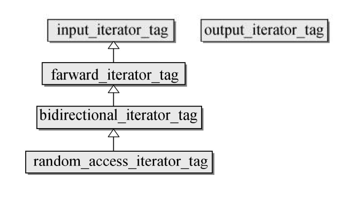

# Iterator

### 一.迭代器的种类

1.输入型迭代器(input_iterator):read-only迭代器，只能以累加(++)操作符向前迭代<br>
2.输出型迭代器(output_iterator):write-only迭代器，只能以累加(++)操作符向前迭代<br>
3.单向迭代器(forward_iterator):具有input_iterator所有特性，非const迭代器具有output_iterator所有特性(forward_list,unordered_set/map,unordered_multiset/map)<br>
4.双向迭代器(bidirectional_iterator):具有forward_iterator所有特性,并且可以累减(--)操作符向后迭代(list,set,map,multiset,multimap)<br>
5.随机访问迭代器(random_access_iterator):具有bidirectional_iterator所有特性,并可以进行算术(+,-,*,/)操作(vector,deque,array)<br>




```cpp
struct input_iterator_tag{};
struct output_iterator_tag{};
struct forward_iterator_tag : public input_iterator_tag{};
struct bidirectional_iterator_tag : public forward_iterator_tag{};
struct random_access_iterator_tag : public bidirectional_iterator_tag{};

/*以下是五种迭代器类型数据类型*/
template <class _Tp, class _Distance> 
struct input_iterator {
  typedef input_iterator_tag iterator_category; //迭代器类型
  typedef _Tp                value_type; //元素数据类型
  typedef _Distance          difference_type; //元素大小类型
  typedef _Tp*               pointer; //元素指针
  typedef _Tp&               reference;  //元素引用
};

struct output_iterator {
  typedef output_iterator_tag iterator_category;
  typedef void                value_type;
  typedef void                difference_type;
  typedef void                pointer;
  typedef void                reference;
};

template <class _Tp, class _Distance> 
struct forward_iterator {
  typedef forward_iterator_tag iterator_category;
  typedef _Tp                  value_type;
  typedef _Distance            difference_type;
  typedef _Tp*                 pointer;
  typedef _Tp&                 reference;
};

template <class _Tp, class _Distance> 
struct bidirectional_iterator {
  typedef bidirectional_iterator_tag iterator_category;
  typedef _Tp                        value_type;
  typedef _Distance                  difference_type;
  typedef _Tp*                       pointer;
  typedef _Tp&                       reference;
};

template <class _Tp, class _Distance> 
struct random_access_iterator {
  typedef random_access_iterator_tag iterator_category;
  typedef _Tp                        value_type;
  typedef _Distance                  difference_type;
  typedef _Tp*                       pointer;
  typedef _Tp&                       reference;
};
```

<br>

### 二.操作

函数|详情
--|--
c.begin()|指向第一个元素的读写迭代器
c.end()|指向最后一个元素的下一个位置的读写迭代器
c.rbegin()|反向的第一个元素的读写迭代器
c.rend()|反向的第一个元素的上一个位置读写迭代器
c.cbegin()|指向第一个元素的只读迭代器
c.cend()|指向最后一个元素的下一个位置的只读迭代器
c.crbegin()|反向的第一个元素的只读迭代器
c.crend()|反向的第一个元素的上一个位置只读迭代器


```cpp
class MyIterator : public iterator<input_iterator_tag, int>
{
private:
    int* arr;
public:
    MyIterator(int* p) :arr(p) {}
    MyIterator(const MyIterator& it) : arr(it.arr) {}
    MyIterator& operator++() {++arr;return *this;}
    MyIterator operator++(int) {MyIterator tmp(*this); ++*this; return tmp;}
    bool operator==(const MyIterator& it) const {return arr==it.arr;}
    bool operator!=(const MyIterator& it) const {return arr!=it.arr;}
    int& operator*() {return *arr;}
};


int main() {
    int arr[]={10,20,30,40,50};
    MyIterator from(arr);
    MyIterator end(arr+5);
    for (MyIterator it=from; it!=end; it++)
            cout << *it << ' ';
    return 0;
}
```

<br>

### 三.源码分析

>1.迭代器萃取机

```cpp
/*Traits技术，萃取出类型的相关信息*/
template<typename _Iterator>
struct iterator_traits {
      typedef typename _Iterator::iterator_category iterator_category;
      typedef typename _Iterator::value_type        value_type;
      typedef typename _Iterator::difference_type   difference_type;
      typedef typename _Iterator::pointer           pointer;
      typedef typename _Iterator::reference         reference;
};

/*针对原生指针Tp*生成的Traits偏特化版本*/
template<typename _Tp>
struct iterator_traits<_Tp*>{
      typedef random_access_iterator_tag iterator_category;
      typedef _Tp                         value_type;
      typedef unsigned int                difference_type;
      typedef _Tp*                        pointer;
      typedef _Tp&                        reference;
};
```

>2.其他方法

```cpp
/*求出迭代器的类型*/
template <class _Iter>
inline typename iterator_traits<_Iter>::iterator_category
__iterator_category(const _Iter&)
{
  typedef typename iterator_traits<_Iter>::iterator_category _Category;
  return _Category();
}

template <class _Iter>
inline typename iterator_traits<_Iter>::iterator_category
iterator_category(const _Iter& __i) { return __iterator_category(__i); }


/*求出迭代器的distance_type*/
template <class _Iter>
inline typename iterator_traits<_Iter>::difference_type*
__distance_type(const _Iter&)
{
  return static_cast<typename iterator_traits<_Iter>::difference_type*>(0);
}

template <class _Iter>
inline typename iterator_traits<_Iter>::difference_type*
distance_type(const _Iter& __i) { return __distance_type(__i); }


/*求出迭代器的value_type*/
template <class _Iter>
inline typename iterator_traits<_Iter>::value_type*
__value_type(const _Iter&)
{
  return static_cast<typename iterator_traits<_Iter>::value_type*>(0);
}

template <class _Iter>
inline typename iterator_traits<_Iter>::value_type*
value_type(const _Iter& __i) { return __value_type(__i); }
```