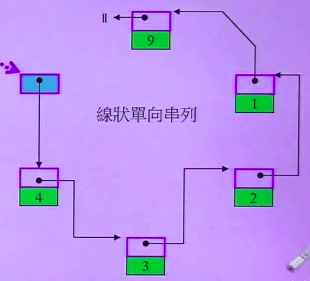

# Forward List

1.单向链表，顺序访问<br>
2.只能从头部插入元素<br>
3.元素排列顺序与插入顺序有关<br>
4.比Deque所需空间小


### 一.定义

函数|详情
--|--
forward_list<int> l|默认构造
forward_list<int> l1(l)|拷贝构造
forward_list<int> l1 = l|赋值拷贝
forward_list<int> l(5,2)|指定大小与默认值
forward_list<int> l = {1,2,3}|初始化

<br>

### 二.操作

函数|详情
--|--
l.push_front(0)|向头插入
l.emplace_front(0)|构造并向头插入
l.insert_after(l.begin(), 0)|其他位置插入
l.emplace_after(l.begin(),0)|构造并其他位置插入
l.pop_front()|头弹出
l.erase_after(l.begin())|移除其他位置元素
l.remove(1)|删除元素1
l.clear()|清空
l.front()|返回头元素
l.empty()|判断容器是否为空
l.unique()|去重
l.reverse()|反转
l.sort()|排序
l1.swap(l2)|l1与l2交换
l1.merge(l2)|有序的l1与有序l2连接


```cpp
forward_list<int> list1 = {1,2,1,3};
forward_list<int> list2 = {4,9,7};
list1.unique();
list1.remove(3);
list1.sort();
list2.sort();
list1.merge(list2);
for(auto it : list1)
    cout<<it<<" "; //1 2 4 7 9
```

<br>

### 三.源码分析



>1.forward_list结构

```cpp
//节点结构
struct _Fwd_list_node_base{
    _Fwd_list_node_base* _M_next = nullptr; //指向下一个节点
};

//forward_list结构
template<typename _Tp, typename _Alloc>
struct _Fwd_list_base{
    protected:
      struct _Fwd_list_impl : public _Node_alloc_type {
	   _Fwd_list_node_base _M_head; //指向头结点(蓝色元素)
      }_M_impl;
}
```

>2.成员函数

```cpp
//判断是否为空
bool empty() const noexcept { return this->_M_impl._M_head._M_next == 0; }

//返回首元素
reference front() {
    _Node* __front = static_cast<_Node*>(this->_M_impl._M_head._M_next);
    return *__front->_M_valptr();
}

//头插入
void push_front(const _Tp& __val) { this->_M_insert_after(cbefore_begin(), __val); }

//头弹出   
void pop_front() { this->_M_erase_after(&this->_M_impl._M_head); }

//插入
iterator insert_after(const_iterator __pos, const _Tp& __val) { return iterator(this->_M_insert_after(__pos, __val)); }

//删除
iterator erase_after(const_iterator __pos) { return iterator(this->_M_erase_after(const_cast<_Node_base*> (__pos._M_node))); }
```
