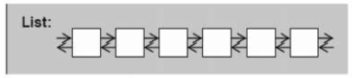
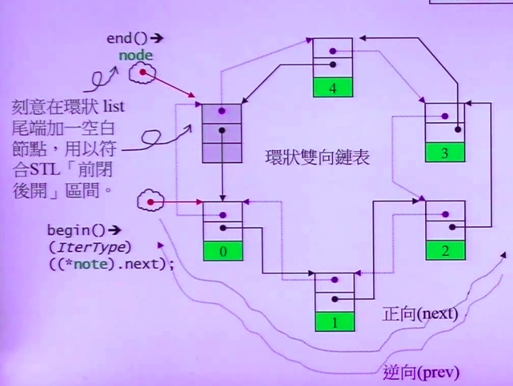

# List

1.双向链表，顺序访问<br>
2.任何位置插入或移除元素快<br>
3.元素排列顺序与插入顺序有关



### 一.定义

函数|详情
--|--
list<int\> l|默认构造
list<int\> l1(l)|拷贝构造
list<int\> l1 = l|赋值拷贝
list<int\> l(5,2)|指定元素个数及与默认值
list<int\> l = {1,2,3}|初始化

<br>

### 二.操作

函数|详情
--|--
l.push_front(1)|向头插入
l.emplace_front(1)|构造并向头插入
l.push_back(1)|向尾插入
l.emplace_back(1)|构造并向尾插入
l.insert(l.begin(),2)|其他位置插入
l.emplace(l.begin(),2)|构造并向其他位置插入
l.pop_front()|头弹出
l.pop_back()|尾弹出
l.erase(l.begin())|移除其他位置元素
l.remove(2)|删除元素2
l.clear()|清空
l.front()|返回头元素
l.back()|返回尾元素
l.size()|返回元素个数
l.empty()|判断容器是否为空
l.unique()|去重
l.reverse()|反转
l.sort()|排序
l1.swap(l2)|l1与l2交换
l1.merge(l2)|有序的l1与有序l2连接


```cpp
list<int> list1 = {2,1,1,3};
list<int> list2 = {4,9,7};
list1.unique();
list1.remove(3);
list1.sort();
list2.sort();
list1.merge(list2);
for(auto it : list1)
  cout<<it<<" "; //1 2 4 7 9
```

<br>

### 三.源码分析

>1.list结构



```cpp
//list链表节点的数据结构
struct _List_node_base{
    _List_node_base* _M_next; //指向下一个节点
    _List_node_base* _M_prev; //指向前一个节点
    Tp _M_data; //节点数据
}

//双向链表list类的定义
template <class _Tp>
class list : protected _List_node_base<_Tp> { 
protected:
  //定义指向链表节点指针，即为end节点
  _List_node_base<_Tp>* _M_node;

  //返回begin迭代器
  iterator begin()             { return _M_node->_M_next; }
  const_iterator begin() const { return  _M_node->_M_next; }
  //返回end迭代器
  iterator end()             { return _M_node; }
  const_iterator end() const { return _M_node; }
};
```

>2.成员函数

```cpp
//判断链表是否为空链表
bool empty() const { return _M_node->_M_next == _M_node; }

//返回链表的大小
size_type size() const {
  size_type __result = 0; 
 //返回两个迭代器之间的距离
 distance(begin(), end(), __result);
 //返回链表的元素个数
 return __result;
}

//返回第一个节点数据的引用
reference front() { return *begin(); }
const_reference front() const { return *begin(); }

//返回最后一个节点数据的引用
reference back() { return *(--end()); }
const_reference back() const { return *(--end()); }

//在链表头插入节点
void push_front(const _Tp& __x) { insert(begin(), __x); }
void push_front() {insert(begin());}

//在链表尾插入节点
void push_back(const _Tp& __x) { insert(end(), __x); }
void push_back() {insert(end());}
 
//取出第一个数据节点
void pop_front() { erase(begin()); }

//在指定的位置插入初始值为x的节点
iterator insert(iterator __position, const _Tp& __x) {
  //首先创建一个初始值为x的节点，并返回该节点的地址
  _Node* __tmp = _M_create_node(__x); 
  //调整节点指针，把新节点插入到指定位置
  __tmp->_M_next = __position._M_node;
  __tmp->_M_prev = __position._M_node->_M_prev;
  __position._M_node->_M_prev->_M_next = __tmp;
  __position._M_node->_M_prev = __tmp;
  //返回新节点地址
  return __tmp;
}

//在指定位置position删除节点，并返回直接后继节点的地址
iterator erase(iterator __position) {
    //调整前驱和后继节点的位置
    _List_node_base* __next_node = __position._M_node->_M_next;
    _List_node_base* __prev_node = __position._M_node->_M_prev;
    _Node* __n = (_Node*) __position._M_node;
    __prev_node->_M_next = __next_node;
    __next_node->_M_prev = __prev_node;
    _Destroy(&__n->_M_data);
    _M_put_node(__n);
    return iterator((_Node*) __next_node);
}
};
```
