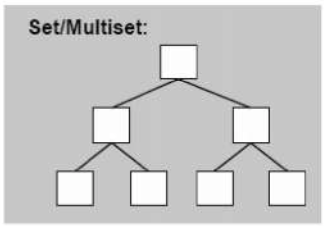

# Set(Multiset)

1.根据元素的value值进行排序<br>
2.set每个元素只能出现一次,multiset每个元素可以出现多次<br>
3.底层是红黑树<br>
4.无法使用迭代器改变set/multiset改变元素值



### 一.定义

函数|详情
--|--
set<int\> c|默认构造
set<int\> c1(c)|拷贝构造
set<int\> c1 =c|赋值拷贝
set<int\> c1 = {1,2,3,7,6,4,5}|初始化

<br>

### 二.操作

函数|详情
--|--
c.insert(10)|插入
c.erase(10)|删除
c.clear()|清空
c.size()|返回元素个数
c.empty()|判断容器是否为空
c.count(1)|元素出现个数

<br>

### 三.源码分析

>1.set结构

```cpp
template <class _Key, class _Compare, class _Alloc>
class set {
public:
  //在set中key就是value, value同时也是key 
  typedef _Key     key_type;
  typedef _Key     value_type;
  //以下key_compare和value_compare使用相同的比较函数 
  typedef _Compare key_compare;
  typedef _Compare value_compare;
private:
	//set的底层机制是采用RB-Tree数据结构
  typedef _Rb_tree<key_type, value_type, _Identity<value_type>, key_compare, _Alloc> _Rep_type;
  _Rep_type _M_t;
public:
  //指针/引用/迭代器全为只读
  typedef typename _Rep_type::const_pointer pointer;
  typedef typename _Rep_type::const_pointer const_pointer;
  typedef typename _Rep_type::const_reference reference;
  typedef typename _Rep_type::const_reference const_reference;
  typedef typename _Rep_type::const_iterator iterator;
  typedef typename _Rep_type::const_iterator const_iterator;
  typedef typename _Rep_type::const_reverse_iterator reverse_iterator;
  typedef typename _Rep_type::const_reverse_iterator const_reverse_iterator;
  typedef typename _Rep_type::size_type size_type;
  typedef typename _Rep_type::difference_type difference_type;
  typedef typename _Rep_type::allocator_type allocator_type;
}
```

>2.set成员函数

```cpp
//判断是否为空
bool empty() const { return _M_t.empty(); }

//根据返回值的情况,判断是否插入该元素,pair.second为true则表示已插入该元素 
pair<iterator,bool> insert(const value_type& __x) { 
   pair<typename _Rep_type::iterator, bool> __p = _M_t.insert_unique(__x); 
   return pair<iterator, bool>(__p.first, __p.second);
}

//擦除指定位置的元素
void erase(iterator __position) { 
   typedef typename _Rep_type::iterator _Rep_iterator;
   _M_t.erase((_Rep_iterator&)__position); 
}

//返回指定元素的个数
size_type count(const key_type& __x) const {
   return _M_t.find(__x) == _M_t.end() ? 0 : 1;
}
```

>3.multiset成员函数

```cpp
//插入数据节点
iterator insert(const value_type& __x) { 
  return _M_t.insert_equal(__x);
}
```
